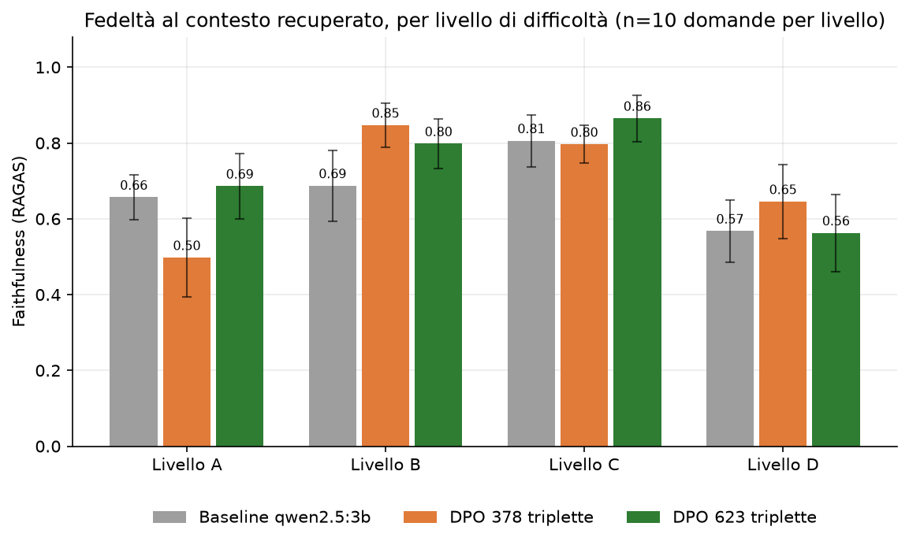
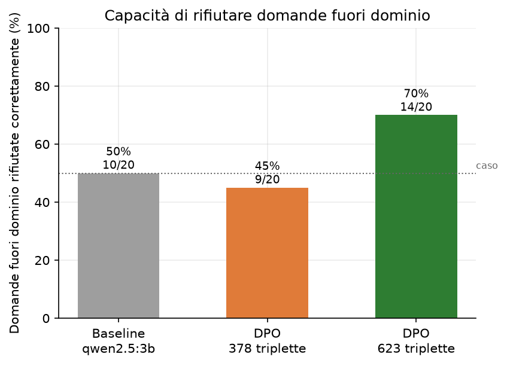
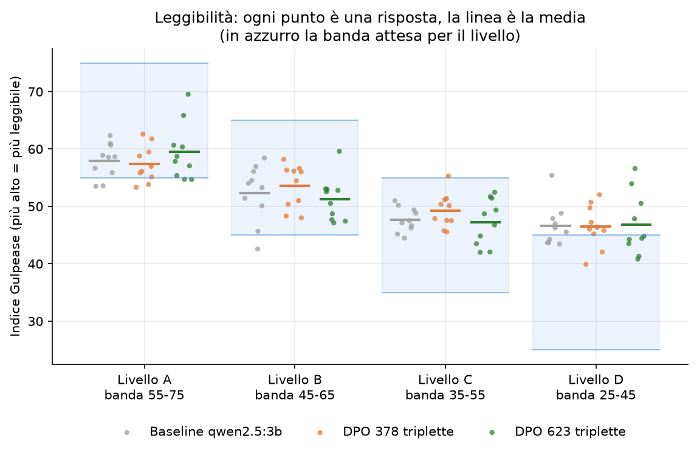
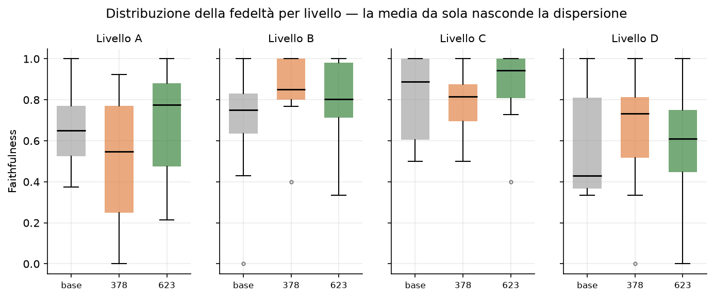
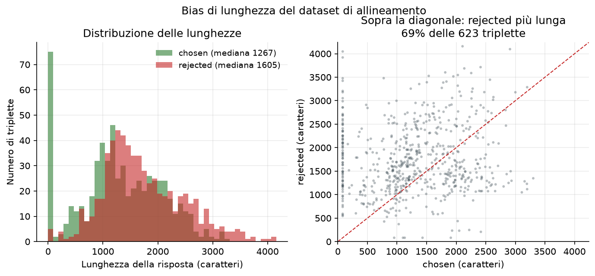
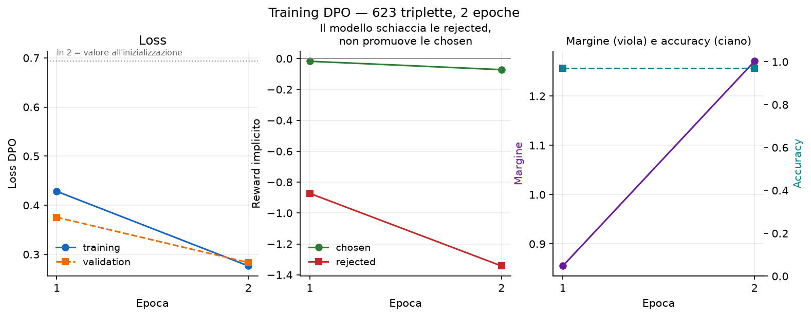

# Log — AstroTutor (Progetto IR)

> Creato il 26/07/2026  
> Ultimo aggiornamento: 26/07/2026

## Indice sessioni
- 01/10/2025 — Ideazione progetto, definizione architettura e stack tecnologico
- 15/04/2026 — Setup, pipeline completa (parsing → generation) e A/B testing
- 04/07/2026 — Pianificazione architetturale per Alignment (DPO) e Guardrails
- 06/07/2026 — Espansione dataset via API (Livelli A/B) e fixing moduli di download
- 07/07/2026 — Pulizia duplicati e consolidamento file parsati
- 11/07/2026 — Audit qualità dati, retrieval con fallback di livello, arricchimento Livello A e valutazione MinerU
- 13/07/2026 — Ricostruzione indice ChromaDB, pulizia directory temporanee, decisione finale su Gravitation e implementazione fase di allineamento (RLAIF + DPO + Guardrails)
- 20/07/2026 — Finalizzazione del dataset DPO (379 triplette), esclusione della fonte narrativa duplicata dal pool di generazione, avvio e debug del training DPO su Kaggle
- 21/07/2026 — Debug del secondo OOM CUDA (in evaluation) sul training DPO Kaggle e hardening del checkpointing contro la perdita di progresso
- 22/07/2026 — Completamento pipeline di export (merge → GGUF → Ollama), primo confronto diretto qwen2.5:3b vs astrotutor-dpo, diagnosi e correzione dei difetti del dataset di allineamento, costruzione di `evaluation.py` con giudice locale
- 23/07/2026 — Completamento della rigenerazione automatica del dataset, audit di qualità, valutazione Fase 6 completata (primi risultati quantitativi DPO vs baseline), debug del riallenamento Kaggle sul dataset ampliato
- 25/07/2026 — Sessione di ricerca e audit: knowledge base `paper/wiki/`, audit del codice contro la specifica, progettazione della Fase 2, diagnosi definitiva della catena di OOM e completamento del riallenamento DPO sulle 623 triplette
- 26/07/2026 — **Valutazione comparativa a tre bracci completata** (baseline / DPO 378 / DPO 623), costruzione dell'infrastruttura di analisi e grafici (`src/analysis.py`), progettazione della rivalutazione deterministica su Colab con giudice 14B e debug del relativo notebook — **(seconda parte)** run Colab completata e analizzata: **i risultati non replicano le conclusioni della run locale**, metrica di rifiuto OOD trovata difettosa, audit del dataset di allineamento e del retrieval, riprogettazione della fase di allineamento verso SFT — **(terza parte)** pulizia del repository, **valutazione del retrieval con metriche IR classiche completata** (`src/retrieval_eval.py`: 172 query, 6 configurazioni in ablazione cumulativa, Recall@k / MRR / nDCG), grafici 7 e 8 generati, verdetto esplicito sul raggiungimento dell'obiettivo del progetto

---

## Sessione — 26/07/2026

### Cosa ho fatto

**Installazione del modello v2 e preparazione del confronto**
- Rinominato il GGUF prodotto dal training del 25/07 in `astrotutor-3b-dpo-v2-Q4_K_M.gguf`, spostato in `models/` e creato `models/Modelfile.v2` con la direttiva `FROM` aggiornata al nuovo nome.
- Installato il modello su Ollama come `astrotutor-dpo-v2`, **senza sovrascrivere** `astrotutor-dpo` (il modello a 378 triplette): la directory `models/` era in `.gitignore`, quindi un sovrascrittura sarebbe stata irreversibile.
- Modificato `.gitignore`: da `models/` (tutta la cartella) a `models/*.gguf` più `*.gguf`. I Modelfile sono ricette di poche righe e vanno versionate; i due GGUF da ~2 GB no.
- Passato da un confronto a **due bracci** a uno a **tre bracci**: `qwen2.5:3b` (baseline) / `astrotutor-dpo` (378 triplette) / `astrotutor-dpo-v2` (623 triplette), con iperparametri di training identici fra i due modelli allineati.

**Estensione di `src/evaluation.py`**
- Aggiunto il terzo braccio in `MODELS`.
- Alzato il timeout del client del giudice da 300 a **900 s**, dopo un timeout reale a 26/40 domande.
- Avvolta la chiamata al giudice in un `try/except`: una domanda fallita viene **saltata senza essere scritta nel file di progresso**, così un rilancio successivo la ritenta invece di perderla o di far abortire l'intera run.
- Esteso il dizionario dei risultati con i campi `contexts` (i chunk su cui il giudice ha votato) e `sources` (titolo, file, livello, `level_match`, score del re-ranker per ogni chunk recuperato).

**Valutazione locale a tre bracci — completata**
- Lanciata in background e portata a termine: 40 domande × 3 modelli con giudice `qwen2.5:7b-instruct` in locale, più 20 domande OOD per braccio.
- Risolto in corsa un `UnicodeEncodeError` sul carattere `✓` dovuto allo stdout in cp1252 quando l'output viene rediretto su file (nessuna modifica al codice: `PYTHONIOENCODING=utf-8` al lancio).

**Infrastruttura di analisi**
- Scritto `src/analysis.py` (697 righe): legge i file già prodotti — `eval_results.json`, i tre `eval_progress_*.jsonl`, `alignment_data.json`, `training_metrics.json` — e produce i grafici del report in `report/figures/`. **Non rigenera nulla** e non chiama né Ollama né la GPU.
- Implementati 10 grafici; i 6 con dati disponibili sono stati generati, i 4 rimanenti stampano uno *skip* motivato con lo schema JSON che li sbloccherebbe (`retrieval_eval.json` per i todo #1/#2, `latency.json` per il todo P0, il campo `sources` per il grafico degli score).
- Aggiunta la funzione `tabella_riassuntiva()`, che scrive `report/figures/tabella_risultati.md` già pronta da incollare nel report.
- Creato `data/training_metrics.json`: le metriche per epoca del training DPO **trascritte a mano** dalla tabella stampata dal `DPOTrainer`, perché con `report_to="none"` TRL non le salva su alcun file. Il campo `_nota` documenta la provenienza.

**Decisione di rifare la valutazione su Colab e notebook relativo**
- Valutata e scartata l'ipotesi di *rigiudicare soltanto* con un modello più grande: cambiare giudice impone di rigiudicare tutti e tre i bracci, e siccome contestualmente si voleva anche rendere deterministica la generazione, tanto vale rigenerare tutto.
- Scritto `src/evaluation_colab.ipynb` (26 celle): mount Drive → verifica file → pip con versioni pinnate → installazione Ollama → estrazione del repo dallo zip → patch dei sorgenti → pull/create dei 4 modelli → indicizzazione → smoke test → run completa → copia dei risultati su Drive.
- Configurazione della run: giudice `qwen2.5:14b-instruct`, `temperature=0.0` + `seed=42` su tutti e 4 i punti di chiamata di `generation.py`, embedder e re-ranker su `cuda`.
- Il notebook **non tocca il repository**: applica 7 sostituzioni regex alla copia scompattata in `/content/unzip`.

**Discussioni tecniche e pianificazione**
- Valutata l'ipotesi di un Dockerfile da passare alla persona con la RTX 4060: accertato che serve trasportare solo `data/processed/chunks/` (~35 MB, tracciato), perché `data/raw/` (458 MB) non è necessario e `data/vector_db/` (263 MB) è rigenerabile da `src/indexing.py`.
- Stabilita la ripartizione locale/Colab per le valutazioni residue: **solo il giudice grande richiede Colab**; i due encoder da ~568M (~2,3 GB in fp16) stanno nella RTX 3050 da 4 GB locale, perché in quelle fasi nessun LLM compete per la memoria.
- Declassato il todo #3 (rescoring di fattualità F-DPO, ~1.246 chiamate al giudice, stimate 30-50 h): il problema che doveva risolvere — il calo di faithfulness a livello A — è rientrato da solo con il dataset ampliato.

**Debug del notebook Colab**
- Risolti in sequenza sei errori di esecuzione (dettaglio in *Problemi & soluzioni*): struttura dello zip diversa dall'atteso, separatori `\` nei nomi dei file dentro lo zip prodotto da PowerShell, `zstd` mancante per l'installazione di Ollama, disallineamento di versione della catena `ragas`/`langchain`, cella di estrazione che cancellava l'indice appena costruito, e un `\n` malformato nel generatore.
- Reso **idempotente** il blocco di estrazione: se il repo è già presente non riestrae, e stampa due controlli di stato (patch applicate sì/no, indice ChromaDB presente sì/no) che dicono quali celle si possono saltare.
- Verificata la proposta dell'utente di aggiungere `langchain-community` e `google-cloud-aiplatform`: il primo è legittimo (è installato in locale, dove tutto funziona), il secondo non serve.
- Chiarito che il rilancio del notebook dall'alto è sicuro (nessuna cella è distruttiva se ripetuta) e che il riavvio del kernel dopo la cella di `pip` serve solo se in quel kernel erano già stati importati i pacchetti reinstallati.

**Manutenzione**
- Cancellato `src/alignment_dpo_colab.py`, reso ridondante dal notebook — chiude il todo #17.

**(seconda parte) Run Colab completata e analizzata**
- Portata a termine la run di rivalutazione su Colab e scaricati i risultati in `results/eval_qwen2.5_14b-instruct_20260726_1039/` (5 file: `eval_results.json`, i tre `eval_progress_*.jsonl`, `eval_questions.json`), tenuti **separati** dai file locali in `data/`.
- Confrontati i due set braccio per braccio e livello per livello, con errori standard, test appaiati di Wilcoxon e intervalli di confidenza sulle differenze.
- Verificato che nella run Colab il retrieval è **identico fra i tre bracci** (Jaccard 1.00 sui contesti recuperati, tutte e 40 le domande): il confronto interno è controllato, l'unica variabile è il modello.
- Verificato che nella run locale i campi `contexts` e `sources` sono **vuoti** sia in `eval_results.json` sia nei tre file di progresso: la decisione presa in mattinata di renderli autosufficienti vale di fatto solo per la run Colab.
- Misurata la similarità testuale delle risposte fra le due run alla stessa domanda: 0,12-0,26, cioè testi diversi, non varianti dello stesso testo.

**(seconda parte) Bug della metrica di rifiuto OOD**
- Trovato che `src/evaluation.py:77` usa `REFUSAL_MESSAGE in answer`, cioè un match **letterale** della frase canonica, mentre i modelli la parafrasano quasi sempre.
- Ricontate le 20 domande OOD per braccio con un criterio semantico e ispezionate a mano tutte le discordanze: sono rifiuti veri, marcati come non-rifiuti solo perché il modello aggiunge qualche parola in coda.
- Isolate le uniche mancate reali: *fotosintesi clorofilliana* su tutti e tre i bracci e *rinnovo del passaporto* sulla sola baseline.

**(seconda parte) Verifiche puntuali sui dati già disponibili**
- Chiuso il todo #12 con una ricerca testuale: "Bollo Nucleare nel Buco Nero" **non compare** in nessuna risposta della run Colab; compare però *"un enorme **bollo** di caramello"* (per "bolla") nella risposta al Big Bang di **entrambi i bracci allineati** e non della baseline.
- Contati i **falsi rifiuti in dominio** (il modello rifiuta una domanda legittima): 1-2 per braccio, escluderli sposta le medie di ~0,02 — quindi non spiegano il crollo del livello D del v2.
- Contata la distribuzione dei punteggi del giudice (quanti 0, quanti 1) nelle due run per capire se il 14B è semplicemente più severo o più polarizzato.

**(seconda parte) Audit del dataset di allineamento**
- Misurate le 256 coppie `wrong_register` esistenti: il contrasto di registro c'è (livello A: Gulpease 59,9 vs 47,1; livello D: 43,5 vs 56,9), ma la `chosen` la scrive l'oracolo da 70B e la `rejected` il 3B.
- Identificato il confondimento principale della fase di allineamento: **i due lati della preferenza hanno autori diversi**, quindi "scrivi come il modello grande" è una soluzione valida della loss che non richiede di imparare nulla sul registro.
- Contate le risposte dell'oracolo riutilizzabili per un eventuale SFT: 540 uniche, di cui **423 superano guardrail + banda Gulpease** (A 113/127, B 111/125, C 123/131, **D 76/157**).
- Scritto `src/alignment_register.py`, generatore di un dataset DPO a variabile singola (entrambi i lati dal 3B, cambia solo l'istruzione di livello), con filtri deterministici e senza bisogno di retrieval; verificato che gira anche fuori dal repository.
- Simulati i filtri sulle coppie esistenti: 121 sopravvivono con il filtro di lunghezza attivo, 201 senza.

**(seconda parte) Audit del retrieval e del corpus**
- Misurata la copertura del corpus per argomento × livello sui 17.976 chunk: due buchi veri, *Galassie e struttura a grande scala* (24 chunk in tutto, 0 a livello C e D) e *Onde gravitazionali* a livello A (9 chunk disponibili col fallback).
- Misurato il comportamento reale del retrieval sulle 40 domande di valutazione: livello esatto in 19/16/25/26 casi su 30 per A/B/C/D, nessun documento fuori fallback, nessuno score basso.
- Scoperto che la soglia di rifiuto di `generation.py:132` (`score < -5.0`) è su una **scala inesistente**: il `CrossEncoder` applica la sigmoide e i punteggi grezzi stanno in [0,001, 1,000], quindi la soglia non può scattare mai.
- Verificato con una ricerca su tutto il repository che `level_match`, calcolato in `retrieval.py:99`, è usato solo per il logging in `evaluation.py:162` e **mai** da `generation.py`: quando un utente di livello A riceve un chunk di livello B, il prompt non glielo dice.

**(seconda parte) Riprogettazione della fase di allineamento**
- Discussa e scartata l'ipotesi di far generare i dati di preferenza a un modello grande (o all'assistente): reintrodurrebbe esattamente il confondimento appena diagnosticato.
- Riconosciuto il limite dell'alternativa on-policy semplice: se la `chosen` è ciò che il modello già produce col prompt corretto, la DPO può solo aumentare la consistenza, non la capacità — e a livello A/B/C la consistenza è già all'80-100%.
- Individuata la correzione (best-of-N sul Gulpease) e, soprattutto, la conclusione più generale: per trasferire una capacità che il 3B non ha serve **SFT distillato**, non DPO.
- Stimato l'impatto della via SFT sul progetto esistente: 1 script nuovo, 2 celle su 13 del notebook di training, ~30 righe sparse fra `generation.py`, `evaluation.py` e `config.py`; nulla da toccare in `parsing.py`, `chuncking.py`, `indexing.py`, `retrieval.py`, `analysis.py`.

**(terza parte) Pulizia del repository**
- Cancellati `compare_models.py` e `compare_models_result.txt` (script di confronto superato da `evaluation.py`), `main_result_dpo.txt`, `result2.txt` e le `__pycache__/`. Prima di cancellare `result2.txt` ho verificato riga per riga che tutto il suo contenuto fosse già in `data/training_metrics.json`.
- Spostato `result.txt` in `data/training_log_dpo_v1_378triplette.txt`: era l'**unica copia** delle metriche del training v1 e stava nella root con un nome che non diceva nulla.
- Spostato `riepilogo.txt` dentro `results/eval_qwen2.5_14b-instruct_20260726_1039/`, accanto ai risultati che riassume.
- Scritti i due `run_meta.json` previsti ieri: quello locale marcato `"stato": "SUPERATA"` (giudice 7B, `temperature 0.1`, nessun seed, `contexts`/`sources` vuoti) e quello della run Colab (giudice 14B, `temperature=0.0` + `seed=42`, retrieval identico fra i bracci con Jaccard 1.00, caveat sulla colonna OOD letterale).
- Scritto `report/figures/README.md`: avverte che le figure 01-06 provengono dalla run locale superata. Chiude il problema "le figure illustrano conclusioni superate" senza cancellarle.
- Aggiornato `Information Retrieval.md:238` (todo #18): "Colab A100" → "Colab (GPU L4)", "~30-60 min di A100 per ~400 triplette" → "~1h di L4 per le 623 triplette dell'ultimo training".
- **Non** cancellati i file di valutazione in `data/`: sono 300 KB e sono l'unica prova documentale della sezione di tesi che spiega perché la run locale è stata scartata.

**(terza parte) Valutazione del retrieval con metriche IR classiche — `src/retrieval_eval.py`**
- Scritto `src/retrieval_eval.py` (~420 righe), il todo più vecchio e più grave rispetto ai requisiti del corso. Completamente offline: nessun LLM di generazione, nessun giudice, nessun credito.
- **Gold set**: costruito dalle triplette di `data/alignment_data.json` che hanno `source_chunk_file` popolato, cioè quelle in cui la domanda è stata generata **a partire da un chunk noto**. Escluse le triplette topic-based (~380) perché il loro campo `sources` è l'output del retriever stesso: valutare il retriever sul proprio output è circolare. Dopo la deduplica su `(question, user_level)` restano **172 query**: A 40 / B 42 / C 35 / D 55.
- Granularità **di documento**, non di chunk: la domanda è "il PDF giusto è fra i primi k?". Un chunk vicino a quello sorgente è quasi sempre altrettanto valido, quindi valutare a livello di chunk penalizzerebbe successi reali.
- Implementato **Okapi BM25 da zero** (indice invertito `term → [(doc_id, tf)]`, `k1=1.5`, `b=0.75`, IDF calcolata sull'intero corpus e non sul pool ristretto — approssimazione documentata nel codice), con `search()` limitata al pool di livello, così il braccio lessicale e quello denso vedono esattamente gli stessi candidati.
- **Traduzioni pre-generate una volta sola** con un traduttore fisso (`qwen2.5:3b`, `temperature=0.0`) e messe in cache in `data/query_translations.json`: 172/172 in ~2 minuti. Risolve lato valutazione il todo #15 — a runtime `generation.py:_translate_query` usa `self.model_name`, quindi ogni braccio tradurrebbe con un modello diverso e il retrieval non sarebbe più la stessa funzione.
- **Sei configurazioni cumulative**, ognuna aggiunge un solo componente alla precedente: `BM25` → `BM25 + expansion` → `solo bi-encoder` → `+ re-ranker` → `+ query expansion` → `+ bonus livello` (l'ultima è la pipeline di produzione). Gli score del re-ranker sono calcolati una volta e riusati nelle configurazioni 4-6, altrimenti la run durerebbe il triplo.
- Metriche: **Recall@{1,3,5,10,20}**, **MRR** e **nDCG@10**, con profondità 20 e `INITIAL_K = 20`.
- Output: `data/retrieval_eval.json` (schema già atteso da `analysis.py`), `data/retrieval_eval_meta.json` (provenienza, conteggi per livello, Recall@3 per livello) e `data/retrieval_eval_details.jsonl` (rango del gold per ogni query e configurazione, per l'analisi dei fallimenti).

**(terza parte) Grafici, diagnosi della lentezza e verdetto**
- Generati i grafici **7** (`07_recall_at_k.png`) e **8** (`08_mrr_ndcg.png`) con `python src/analysis.py --only 7 8`: erano fra i quattro *skip* che `analysis.py` elencava da ieri, ora ne restano due.
- Diagnosticata con misure — non a occhio — la lentezza della run: BM25 escluso (0,0 s per ricerca, 1,7 s per costruire l'indice), embedding della query 0,48-1,24 s, regime stazionario 4,3 s/query dominato dal **cross-encoder**. Le ultime 32 query sono degradate a ~40 s/query; verificato che **non** dipende dai dati (mix di livelli e lunghezza delle domande comparabili), quindi è spillover di VRAM sulla 3050 da 4 GB.
- Aggiornato `TODO.md` con la tabella completa dei risultati, il Recall@3 per livello e tre findings per la tesi; sezione 2️⃣ da "❌ il buco più grave" a "✅ fatta"; todo P7 sbloccato da ⛔ a 🟢 con l'evidenza numerica.
- Formulato per la prima volta un **verdetto esplicito sull'obiettivo del progetto** (vedi *Risultati*), che finora era rimasto implicito in metriche sparse su tre report.

### Artefatti prodotti / modificati
- `models/astrotutor-3b-dpo-v2-Q4_K_M.gguf` — **nuovo**, il modello allineato sulle 623 triplette (non tracciato da git, ~2 GB).
- `models/Modelfile.v2` — **nuovo**, ricetta Ollama del modello v2, ora tracciata da git.
- `models/Modelfile` — ora tracciato da git (prima escluso dall'ignore sull'intera cartella).
- `.gitignore` — modificato: `models/` → `*.gguf` + `models/*.gguf`.
- `src/evaluation.py` — modificato: terzo braccio, timeout del giudice 300 → 900 s, `try/except` con salto-e-ritenta, campi `contexts` e `sources` nei risultati.
- `src/analysis.py` — **nuovo**, 697 righe. 10 grafici + tabella riassuntiva, legge i risultati esistenti senza rigenerarli. Flag `--only N...` e `--list`.
- `src/evaluation_colab.ipynb` — **nuovo**, 26 celle. Rivalutazione deterministica a 3 bracci su Colab con giudice 14B.
- `src/alignment_dpo_colab.py` — **cancellato** (todo #17 chiuso).
- `data/training_metrics.json` — **nuovo**, metriche per epoca del training DPO trascritte a mano dal log di Colab.
- `data/eval_results.json` — riscritto con i tre bracci.
- `data/eval_progress_qwen2.5_3b.jsonl`, `data/eval_progress_astrotutor-dpo.jsonl`, `data/eval_progress_astrotutor-dpo-v2.jsonl` — file di progresso per braccio, riusabili per rigiudicare senza rifare il retrieval.
- `report/figures/01_faithfulness_per_livello.png` … `06_training_dpo.png` — **nuovi**, 6 grafici.
- `report/figures/tabella_risultati.md` — **nuovo**, tabelle dei risultati generate da `analysis.py`.
- `result2.txt` — log grezzo della tabella di training del `DPOTrainer`, finito nella root del repository (da spostare o cancellare).
- `scratchpad/make_eval_nb.py` — generatore del notebook di valutazione, fuori dal repository.
- **(seconda parte)** `results/eval_qwen2.5_14b-instruct_20260726_1039/` — **nuova**, i 5 file della run Colab scaricati da Drive (`eval_results.json` 740 KB, i tre `eval_progress_*.jsonl` ~220 KB ciascuno con `contexts` e `sources` popolati, `eval_questions.json`).
- **(seconda parte)** `riepilogo.txt` — **nuovo**, tabella riassuntiva stampata dalla run Colab, nella root del repository (da spostare accanto ai risultati).
- **(seconda parte)** `src/alignment_register.py` — **nuovo**, ~300 righe. Genera un dataset DPO in cui l'unica variabile è il registro: `chosen` e `rejected` dallo stesso modello, con la sola riga di stile del prompt sostituita. Filtri deterministici (gap Gulpease, rapporto di lunghezza, similarità, rifiuti), ripartibile, funziona anche come file singolo fuori dal repo. Flag `--report`, `--limit`, `--min-gap`, `--no-length-gate`.
- **(seconda parte)** `scratchpad/celle_colab_registro.py` — tre celle pronte da incollare nel notebook di training (Ollama + generazione + salvataggio su Drive), fuori dal repository.
- **(seconda parte)** Memoria di progetto `eval-colab-14b-non-replica.md` — fuori dal repository, registra che le conclusioni scritte in questo report la mattina sono sospese.
- **(terza parte)** `src/retrieval_eval.py` — **nuovo**, ~420 righe. Valutazione IR classica del retrieval con BM25 implementato da zero, gold set silver-standard a granularità di documento e ablazione cumulativa a 6 configurazioni. Interamente offline.
- **(terza parte)** `data/retrieval_eval.json` — **nuovo**, le metriche delle 6 configurazioni nello schema atteso da `analysis.py`.
- **(terza parte)** `data/retrieval_eval_meta.json` — **nuovo**, provenienza del gold set, conteggi per livello, parametri della run e Recall@3 per livello.
- **(terza parte)** `data/retrieval_eval_details.jsonl` — **nuovo**, una riga per query con il rango del documento gold in ciascuna configurazione: è il file da cui si analizzano i fallimenti senza rilanciare nulla.
- **(terza parte)** `data/query_translations.json` — **nuovo**, le 172 traduzioni EN generate una volta sola con traduttore fisso e deterministico.
- **(terza parte)** `data/run_meta.json` — **nuovo**, marca la run locale come `SUPERATA` e ne registra giudice e parametri.
- **(terza parte)** `results/eval_qwen2.5_14b-instruct_20260726_1039/run_meta.json` — **nuovo**, metadati della run Colab (chiude il todo scritto in mattinata).
- **(terza parte)** `report/figures/07_recall_at_k.png`, `08_mrr_ndcg.png` — **nuovi**, i due grafici che ieri `analysis.py` saltava per mancanza di dati.
- **(terza parte)** `report/figures/README.md` — **nuovo**, avverte che le figure 01-06 vengono dalla run locale superata.
- **(terza parte)** `data/training_log_dpo_v1_378triplette.txt` — ex `result.txt`, spostato e rinominato (unica copia delle metriche del training v1).
- **(terza parte)** `compare_models.py`, `compare_models_result.txt`, `main_result_dpo.txt`, `result2.txt`, `__pycache__/` — **cancellati**.
- **(terza parte)** `TODO.md`, `Information Retrieval.md` — aggiornati.

### Risultati & analisi

**1. Faithfulness media per livello** (giudice `qwen2.5:7b-instruct`, n=10 domande per livello)

| Livello | Baseline `qwen2.5:3b` | DPO 378 triplette | DPO 623 triplette |
|---|---|---|---|
| A | 0.657 | **0.498** | **0.686** |
| B | 0.687 | **0.847** | 0.798 |
| C | 0.806 | 0.796 | **0.865** |
| D | 0.568 | 0.645 | 0.563 |
| **Media** | **0.679** | **0.697** | **0.728** |

**2. Gulpease: media e aderenza alla banda target**

| Livello | Banda attesa | Baseline | DPO 378 | DPO 623 |
|---|---|---|---|---|
| A | 55-75 | 58.0 — 80% in banda | 57.4 — 80% | 59.5 — 80% |
| B | 45-65 | 52.3 — 90% in banda | 53.6 — 100% | 51.2 — 100% |
| C | 35-55 | 47.7 — 100% in banda | 49.3 — 90% | 47.3 — 100% |
| D | 25-45 | 46.6 — **40% in banda** | 46.5 — **20%** | 46.8 — **60%** |

**3. Rifiuto fuori dominio** (20 domande OOD per braccio)

| Modello | Rifiuti corretti | Tasso |
|---|---|---|
| `qwen2.5:3b` | 10/20 | 50% |
| `astrotutor-dpo` (378) | 9/20 | 45% |
| `astrotutor-dpo-v2` (623) | **14/20** | **70%** |

**Interpretazione**

Il risultato principale è che **la regressione a livello A è rientrata**. Il modello a 378 triplette crollava a 0.498 contro i 0.657 della baseline — un peggioramento del 24% proprio sul livello che il progetto esiste per servire, ed era il problema aperto numero uno dal 23/07. Con 623 triplette il valore risale a 0.686, cioè leggermente **sopra** la baseline. Questo ha una conseguenza diretta sul piano di lavoro: la spiegazione teorica adottata il 25/07 (F-DPO — l'oracolo premia fluidità e analogie sulle `chosen` di livello A, la DPO rinforza quel proxy a scapito della fedeltà) prevedeva un intervento sul dataset *prima* del prossimo riallenamento. Ma il fenomeno è sparito senza alcun intervento, aggiungendo solo 245 esempi. La lettura più probabile è quindi che non fosse un difetto strutturale della DPO su questo dominio, ma **sotto-campionamento**: con ~95 esempi di livello A il modello aveva imparato il tratto superficiale più correlato (il registro semplificato) invece del vincolo di fedeltà; con ~155 il segnale è diventato abbastanza ricco da separare le due cose. Il todo #3 (rescoring di fattualità, 30-50 h di giudice) perde quindi la sua motivazione principale e va declassato — non cancellato, perché resta un esperimento citabile, ma non è più il collo di bottiglia che sembrava ieri.

Il **rifiuto OOD è il salto più netto della valutazione**: da 45-50% a 70%, cioè +25 punti percentuali sulla baseline e +25 sul modello a 378 triplette. È anche l'unico asse dove il modello a 378 triplette faceva *peggio* della baseline (45% contro 50%), il che rende il miglioramento ancora più leggibile: le domande OOD nel dataset di allineamento sono passate da una manciata a un blocco sufficiente a far apprendere il pattern di rifiuto. Va però registrato che 20 domande sono poche: la differenza fra 14/20 e 10/20 è di 4 risposte, e l'intervallo di confidenza binomiale a n=20 è largo circa ±20 punti. Il risultato indica una direzione solida, non una misura precisa.

Sulla **media di faithfulness** la progressione 0.679 → 0.697 → 0.728 è ordinata nella direzione attesa, ma va riportata con cautela: con n=10 per livello, differenze inferiori a ~0.10 non sono distinguibili dal rumore campionario, e la maggior parte delle differenze per-livello sta sotto quella soglia. Le uniche variazioni che superano il rumore sono proprio il crollo e il recupero del livello A (−0.159 e +0.188) e nulla d'altro. In particolare il **livello D peggiora** nel modello v2 (0.563 contro 0.645 del v1 e 0.568 della baseline): è il livello dove nessun braccio funziona bene, ed è coerente con il fatto che sia anche l'unico dove il Gulpease esce dalla banda.

Il **livello D è il difetto sistematico** che questa valutazione mette in evidenza per la prima volta con chiarezza. Tutti e tre i modelli producono risposte con Gulpease ~46.6, mentre la banda universitaria richiede 25-45: nessuno di loro riesce a scendere sotto ~46, cioè a produrre la densità sintattica e lessicale di un testo accademico. La baseline è in banda nel 40% dei casi, il modello a 378 triplette nel 20%, il v2 nel 60%: il DPO migliora l'aderenza (raddoppia rispetto alla baseline) ma non sposta la media, quindi sta riducendo la varianza più che ricalibrando il registro. Sugli altri tre livelli l'aderenza è ottima e il v2 è il migliore o alla pari su tutti.

**Grafici prodotti**

-  — barre raggruppate per livello con barre d'errore SEM, tre bracci. È il grafico che mostra il crollo e il recupero del livello A, e che rende visivamente evidente quanto le barre d'errore si sovrappongano sugli altri livelli.
-  — tasso di rifiuto corretto per braccio (50% / 45% / 70%).
-  — punti individuali sovrapposti alla banda target per livello, invece della sola media. Mostra a colpo d'occhio che il livello D è l'unico dove la nuvola di punti cade fuori banda per tutti e tre i bracci.
-  — boxplot per braccio: serve a giustificare la cautela sulle medie, perché la dispersione è ampia.
-  — istogramma delle lunghezze `chosen` vs `rejected` più scatter, sulle 623 triplette. È l'evidenza grafica del caveat da riportare accanto al 96,9% di reward accuracy.
-  — tre pannelli: loss train/eval, reward `chosen` vs `rejected` (con titolo esplicito "il modello schiaccia le rejected, non promuove le chosen"), margine e accuracy.

I grafici 7-10 (Recall@k, MRR/nDCG, distribuzione degli score del re-ranker, latenza per stadio) sono implementati ma non generati: mancano i file di input, prodotti rispettivamente dai todo #1/#2, #9 e P0. `analysis.py` stampa per ciascuno il motivo e lo schema JSON atteso, così diventeranno disponibili senza altre modifiche al codice.

---

**(seconda parte) 4. Run Colab con giudice 14B — i risultati NON replicano quelli locali**

Stesse 40 domande, giudice `qwen2.5:14b-instruct`, `temperature=0.0` + `seed=42`, encoder su cuda. Faithfulness media per livello, le due run affiancate:

| Braccio | run | A | B | C | D | **media** | OOD (letterale) |
|---|---|---|---|---|---|---|---|
| `qwen2.5:3b` | locale 7B | 0.657 | 0.687 | 0.806 | 0.568 | **0.679** | 10/20 |
| | **Colab 14B** | 0.608 | 0.692 | 0.574 | 0.509 | **0.596** | 9/20 |
| `astrotutor-dpo` (378) | locale 7B | 0.498 | 0.847 | 0.796 | 0.645 | **0.697** | 9/20 |
| | **Colab 14B** | 0.668 | 0.619 | 0.477 | 0.462 | **0.556** | 8/20 |
| `astrotutor-dpo-v2` (623) | locale 7B | 0.686 | 0.798 | 0.865 | 0.563 | **0.728** | 14/20 |
| | **Colab 14B** | 0.565 | 0.740 | 0.610 | 0.350 | **0.566** | 11/20 |

**(seconda parte) 5. Test appaiati sulla run Colab (n=40, stesse domande, stesso retrieval)**

| Confronto | Differenza media | IC 95% | p (Wilcoxon) |
|---|---|---|---|
| baseline − DPO 378 | +0.039 | [−0.050, +0.129] | 0.478 |
| baseline − DPO 623 | +0.030 | [−0.065, +0.125] | 0.662 |
| DPO 378 − DPO 623 | −0.010 | [−0.095, +0.075] | 0.771 |

Differenza minima rilevabile all'80% di potenza con n=40: **≈0.13**. Medie per braccio con IC95: baseline 0.596 ± 0.085, DPO 378 0.556 ± 0.088, DPO 623 0.566 ± 0.080.

**(seconda parte) 6. Rifiuto OOD: metrica letterale contro metrica semantica**

| Braccio | letterale, locale | letterale, Colab | **semantico, locale** | **semantico, Colab** |
|---|---|---|---|---|
| `qwen2.5:3b` | 10/20 | 9/20 | **16/20** | **18/20** |
| `astrotutor-dpo` | 9/20 | 8/20 | **17/20** | **19/20** |
| `astrotutor-dpo-v2` | 14/20 | 11/20 | **18/20** | **19/20** |

**(seconda parte) 7. Aderenza alla banda Gulpease, run Colab**

| Braccio | A (55-75) | B (45-65) | C (35-55) | D (25-45) |
|---|---|---|---|---|
| `qwen2.5:3b` | 58.5 — 80% | 53.3 — 100% | 47.1 — 100% | 47.8 — **40%** |
| `astrotutor-dpo` | 58.1 — 90% | 54.6 — 100% | 47.3 — 100% | 47.7 — **30%** |
| `astrotutor-dpo-v2` | 57.6 — 90% | 50.6 — 100% | 47.7 — 100% | 48.4 — **20%** |

**(seconda parte) 8. Audit del dataset di allineamento**

| Misura | Valore |
|---|---|
| Coppie `wrong_register` | 256 (A 58, B 53, C 70, D 75) |
| Gulpease chosen vs rejected, livello A | 59.9 vs 47.1 (contrasto corretto) |
| Gulpease chosen vs rejected, livello D | 43.5 vs 56.9 (contrasto corretto) |
| Lunghezza chosen vs rejected, livello D | **2263 vs 1312 caratteri** |
| Coppie che superano i filtri deterministici | 121 con filtro di lunghezza, 201 senza |
| Risposte dell'oracolo riutilizzabili per SFT | **423 / 540** (A 113/127, B 111/125, C 123/131, **D 76/157**) |
| Prompt disponibili per un dataset on-policy | 546 (OOD esclusi, deduplicati): D 159, C 134, A 128, B 125 |

**(seconda parte) 9. Copertura del corpus per argomento × livello (17.976 chunk)**

Chunk disponibili al retriever dopo il filtro di livello con fallback:

| Argomento | A | B | C | D |
|---|---|---|---|---|
| Black Hole | 1195 | 1884 | 3199 | 2144 |
| Cosmologia / Big Bang | 2583 | 2841 | 3287 | 738 |
| Wormhole e spazio-tempo | 239 | 305 | 5323 | 5090 |
| Altri oggetti compatti | 232 | 1332 | 2307 | 2085 |
| Evoluzione stellare | 300 | 966 | 2557 | 2305 |
| Onde gravitazionali | **9** | 77 | 1038 | 1032 |
| Galassie e grande scala | **24** | **24** | **13** | **0** |

Distribuzione grezza per livello: A 252 · B 4330 · C 2847 · D 10547.

**(seconda parte) 10. Comportamento reale del retrieval (run Colab, 3 chunk × 10 domande per livello)**

| Livello richiesto | Chunk di livello esatto | Provenienza effettiva | Score mediano |
|---|---|---|---|
| A | 19/30 | A:19 B:11 | +1.06 |
| B | 16/30 | A:2 B:16 C:12 | +1.00 |
| C | 25/30 | B:3 C:25 D:2 | +1.27 |
| D | 26/30 | C:4 D:26 | +1.17 |

Score grezzi del re-ranker (bonus di livello rimosso): min 0.001, p10 0.472, mediana 0.903, max 1.000. **Zero** valori sotto 0, quindi zero sotto la soglia di −5.0.

**Interpretazione (seconda parte)**

Il risultato centrale è che **le tre conclusioni scritte in questo stesso report la mattina non reggono**. Il recupero del livello A non si vede (anzi si inverte: il braccio migliore a livello A è il 378 con 0.668, il v2 è l'ultimo con 0.565); la progressione ordinata delle medie sparisce e si capovolge (la baseline diventa il braccio migliore); il salto del rifiuto OOD era un artefatto della metrica. Regge solo ciò che non dipendeva dal giudice: il Gulpease, stabile fra le due run entro ±1 punto, e il livello D fuori banda su tutti i bracci. Anche qui però il segno cambia: l'aderenza a D con la DPO **peggiora** (40% → 30% → 20%) invece di migliorare come sembrava con la run locale, il che significa che pure quella lettura era rumore.

Le due run **non sono confrontabili fra loro** e non consentono di attribuire il calo a una causa sola: sono cambiate insieme due variabili (giudice e generazione/retrieval) e le risposte sono testi completamente diversi (similarità 0.12-0.26). Ma non sono equivalenti in affidabilità. Nella run Colab il retrieval è identico fra i tre bracci, quindi l'unica variabile del confronto interno è il modello; nella run locale i contesti non sono stati salvati e la traduzione della query era stocastica e fatta da ciascun modello per sé, quindi i tre bracci potrebbero aver visto documenti diversi — e parte dell'ordinamento pulito osservato in mattinata può essere rumore di retrieval. Fra le due, quella su cui basare le conclusioni è la Colab, e quella dice che **la differenza fra i tre bracci non è distinguibile da zero**: p fra 0.48 e 0.77, intervalli di confidenza che attraversano lo zero, differenze osservate di 0.01-0.04 contro una soglia di rilevabilità di 0.13. Non è un risultato debole per mancanza di potenza: è un nullo con un intervallo abbastanza stretto da escludere effetti grandi in entrambe le direzioni.

Il **bug della metrica OOD** merita una riga a sé perché ha prodotto il numero più citato della giornata. Il system prompt chiede al modello di rispondere "ESATTAMENTE con" la frase di rifiuto, e la metrica verifica proprio quello: il 70% del modello v2 misurava **conformità al template**, non comportamento di rifiuto. Contando i rifiuti reali, tutti e tre i bracci stanno a 18-19 su 20 in entrambe le run — la metrica è satura e non discrimina nulla. È comunque un dato interessante che la DPO abbia aumentato la riproduzione letterale della frase (era nelle `chosen` OOD del dataset), ma è un effetto di formato, non di sicurezza.

Sull'**allineamento**, l'audit del dataset spiega perché tre training non hanno prodotto effetti misurabili: nelle coppie la `chosen` la scrive un modello da 70B e la `rejected` il 3B, quindi la loss può essere minimizzata riconoscendo l'autore invece del registro. Il contrasto di registro nel dataset c'è ed è nella direzione giusta — non era quello il difetto — ma è affiancato da un segnale molto più facile da apprendere. A livello D si aggiunge il bias di lunghezza: `chosen` 2263 caratteri contro 1312, cioè "a D, più lungo è meglio" è di nuovo un proxy sufficiente. La conclusione operativa è che il problema non era la quantità di dati (378 → 623 non ha cambiato nulla) ma la loro **struttura**.

Sul **retrieval** l'audit ribalta un'aspettativa: sulle domande di valutazione funziona bene, con i chunk quasi sempre del livello richiesto e punteggi alti. I difetti veri sono altrove. Due sono buchi di corpus — *Galassie* è di fatto assente (24 chunk, zero a C e D) e *Onde gravitazionali* a livello A ha 9 chunk disponibili: su quelle combinazioni il re-ranker non seleziona, riordina rumore, e nessun intervento algoritmico può compensare. Va notato che le 40 domande di valutazione **non toccano questi buchi**, il che spiega perché i numeri del retrieval sembrino sani. Gli altri due sono difetti di codice a costo quasi nullo: la soglia di rifiuto è scritta su una scala che non esiste (il `CrossEncoder` restituisce una sigmoide in [0,1], la soglia è −5.0) e quindi non è "inerte per dimenticanza" ma strutturalmente inattivabile; e `level_match` viene calcolato a ogni query e mai passato al prompt, cioè quando un utente di livello A riceve 11 chunk di livello B su 30 il modello non sa che deve semplificarli.

**Grafici (seconda parte)**

Nessun nuovo grafico prodotto: `analysis.py` non è ancora stato rilanciato sui risultati Colab. Le figure in `report/figures/` si riferiscono tuttora alla run locale, quindi **illustrano conclusioni superate** e vanno rigenerate o etichettate come tali prima di finire nella tesi.

---

**(terza parte) Valutazione del retrieval — ablazione cumulativa su 172 query**

Gold set silver-standard a granularità di documento, profondità 20, nDCG@10. Ogni riga aggiunge **un solo** componente alla precedente; l'ultima è la pipeline effettivamente in produzione.

| Configurazione | R@1 | R@3 | R@5 | R@10 | R@20 | MRR | nDCG@10 |
|---|---|---|---|---|---|---|---|
| BM25 | 0.180 | 0.221 | 0.244 | 0.244 | 0.262 | 0.206 | 0.214 |
| BM25 + expansion | 0.308 | 0.436 | 0.529 | 0.605 | 0.715 | 0.406 | 0.447 |
| solo bi-encoder | **0.576** | 0.733 | 0.826 | 0.884 | 0.884 | 0.674 | 0.725 |
| + re-ranker | 0.523 | 0.762 | 0.831 | 0.884 | 0.884 | 0.651 | 0.708 |
| + query expansion | 0.523 | 0.767 | 0.837 | 0.890 | 0.895 | 0.656 | 0.713 |
| **+ bonus livello** (produzione) | **0.593** | **0.797** | **0.866** | **0.895** | **0.895** | **0.705** | **0.751** |

**Recall@3 per livello** (pipeline di produzione): A **0.700** · B 0.857 · C 0.714 · D 0.873.

Cinque letture di questa tabella.

**Il salto vero è il denso, e vale tre volte tutto il resto.** BM25 da solo sta a R@3 = 0.221, il bi-encoder a 0.733: **+0.512**. Tutti i componenti successivi messi insieme aggiungono +0.064. È il risultato più difendibile del progetto perché è un'ablazione pulita su un baseline standard, ed è anche il più intuitivo da spiegare: le domande sono in italiano discorsivo ("perché le stelle brillano?") mentre i documenti sono manuali tecnici, quindi la sovrapposizione lessicale è quasi nulla e BM25 non ha su cosa lavorare. Da notare che BM25 migliora molto con l'espansione della query (0.221 → 0.436): è la conferma che il suo limite è proprio il vocabolario, non il ranking.

**La pipeline completa trova il documento giusto fra i primi 3 nell'80% dei casi.** R@3 = 0.797 è il numero che conta davvero, perché 3 è esattamente il numero di chunk che vengono passati al generatore: misura la frazione di domande in cui il modello riceve il materiale giusto. R@5 = 0.866 e R@10 = 0.895 dicono anche che il **tetto** è ~0.90, cioè in circa il 10% dei casi il documento gold non è nei primi 20 e nessun riordinamento può recuperarlo — è un problema di rappresentazione o di copertura, non di ranking.

**Il re-ranker peggiora R@1 e MRR.** 0.576 → 0.523 su R@1 e 0.674 → 0.651 su MRR, mentre R@3 e R@5 migliorano (+0.029 e +0.005) e R@10 resta identico. Il cross-encoder cioè **riordina dentro l'insieme già recuperato senza allargarlo**: sposta in alto documenti che stavano in posizione 2-3, ma con altrettanta frequenza scalza dal primo posto quello giusto. Su un gold set a granularità di documento questo è meno grave di quanto sembri (i primi 3 vanno tutti al modello, non solo il primo), ma va detto nel report invece di presentare il re-ranker come un miglioramento uniforme.

**La query expansion non serve.** +0.005 su R@3, +0.005 su nDCG: dentro il rumore su n=172. Costa una chiamata a Ollama per query, cioè circa il **raddoppio della latenza percepita**, ed è a monte del retrieval quindi introduce anche non-determinismo. Questo sblocca il todo P7 (rimuoverla), che era bloccato proprio in attesa di questa misura.

**Il bonus di livello è il secondo contributo più forte** e agisce dove serve: R@1 0.523 → 0.593, MRR 0.651 → 0.705, e a livello A il Recall@3 passa da 0.600 a **0.700**. Vale la pena registrare che era il componente su cui avevo più dubbi: dato che il fallback ammette livelli adiacenti, il bonus può in linea di principio penalizzare un gold che sta a un livello vicino (nello smoke test una domanda di livello A aveva come gold un documento di livello B). Empiricamente il guadagno prevale nettamente.

**Il punto debole è il livello A** (R@3 = 0.700, il più basso dei quattro, contro 0.873 di D). È coerente con la composizione del corpus: 252 chunk di livello A contro 10.547 di livello D. Non è un difetto dell'algoritmo, è la conseguenza diretta dello squilibrio dei dati — e cade proprio sul livello che il progetto esiste per servire.

**Caveat da riportare nella tesi.** Il gold è *silver-standard*: una sola risposta considerata corretta per query, quando in un corpus di manuali di astronomia più documenti coprono lo stesso argomento. I valori assoluti sono quindi un **limite inferiore** del recall reale. Il confronto **fra** configurazioni resta invece pienamente valido, perché la stessa sottostima si applica identica a tutte e sei.

---

**(terza parte) Verdetto sull'obiettivo del progetto**

L'obiettivo dichiarato è: rispondere a domande di astronomia adattando il registro al livello dell'utente, restando ancorati ai documenti. Messi insieme i dati delle tre sessioni, la risposta non è né "sì" né "no" ma si separa per livello.

**Raggiunto per A, B e C.** Il registro si differenzia in modo misurabile e monotono (Gulpease 58.5 → 53.3 → 47.1 da A a C), con 80-100% di aderenza alla banda target; il rifiuto fuori dominio funziona (18-19 su 20 contando i rifiuti semantici); le risposte sono ancorate e con fonti; e ora il retrieval è misurato: nell'80% dei casi il documento giusto è fra i primi 3.

**Non raggiunto per il livello D.** Nessun modello — nemmeno l'insegnante da 70B — scende sotto Gulpease ~47 contro una banda target di 25-45. Il difetto non è la taglia del modello di produzione: è **come il livello D è specificato nel prompt**, più il fatto che il Gulpease cattura la complessità sintattica ma non la densità concettuale, che è ciò che davvero distingue una spiegazione universitaria.

**Non raggiunto come contributo dell'allineamento.** La DPO non ha prodotto effetti misurabili: sotto il protocollo Colab l'effetto sulla fedeltà è indistinguibile da zero e comunque inferiore a 0.13 punti. Ciò che funziona è il sistema costruito prima — RAG con filtro di livello, prompt per livello, guardrail — non i tre training.

La conseguenza per la tesi è che il **contributo va riattribuito**: il risultato del progetto è un sistema RAG adattivo per livello con retrieval misurato in ablazione, e l'allineamento è un'ablazione con esito nullo corredata di diagnosi. Che è una tesi onesta e completa, non una tesi mancata.

### Decisioni prese

| Decisione | Motivazione |
|-----------|-------------|
| Non sovrascrivere `astrotutor-dpo` con il modello v2, ma installarli affiancati | `models/` era in `.gitignore`: sovrascrivere il GGUF a 378 triplette lo avrebbe reso irrecuperabile senza rifare un'ora di training su Colab. Tenendoli entrambi si ottiene un confronto a tre bracci in cui gli iperparametri sono identici e **l'unica variabile è la dimensione del dataset** — l'ablazione più pulita che il progetto abbia sull'alignment |
| `.gitignore`: da `models/` a `models/*.gguf` | I Modelfile sono ricette di 11 righe che documentano esattamente come il GGUF diventa un modello Ollama (template del chat, parametri di stop, system prompt): sono la parte riproducibile e vanno versionate. I pesi da 2 GB no. Escludere l'intera cartella buttava via il documento per non salvare il binario |
| Giudice fallito → salta la domanda e **non** scriverla nel file di progresso | Un timeout su una singola domanda non deve far perdere le decine di chiamate già completate, ma nemmeno essere registrato come risultato mancante permanente. Non scrivendo la riga, il rilancio successivo la ritenta automaticamente: il file di progresso diventa così sia un checkpoint sia una coda di lavoro |
| Salvare `contexts` e `sources` in ogni riga dei file di progresso | Rende i file **autosufficienti**: si può rigiudicare con un modello diverso, su un'altra macchina, senza rifare il retrieval e quindi senza trasportare `data/vector_db` (263 MB). Costa ~2 MB per braccio. Sblocca inoltre il grafico sulla distribuzione degli score del re-ranker, necessario a calibrare la soglia di rifiuto (todo #9) |
| Rigenerare **tutto** su Colab invece di rigiudicare soltanto le risposte esistenti | Cambiare giudice obbliga comunque a rigiudicare tutti e tre i bracci, altrimenti si confrontano numeri prodotti da valutatori diversi. Contestualmente si voleva rendere deterministica la generazione, il che cambia anche le risposte: due modifiche che si sarebbero comunque propagate a tutti i bracci, quindi conviene farle insieme in un'unica run coerente |
| `temperature=0.0` **e** `seed=42` sulla generazione | `temperature=0.1` non è determinismo, è solo bassa varianza: due run possono differire e le differenze fra bracci diventano non riproducibili. Servono entrambi i parametri, e vanno applicati a tutti e 4 i punti di chiamata di `generation.py` (traduzione, generazione, rigenerazione dei guardrail, baseline no-RAG) — altrimenti resta uno stadio stocastico a monte |
| Giudice `qwen2.5:14b-instruct` invece del 7B | La faithfulness è un compito di NLI su testo lungo, dove la taglia del giudice conta più che nella generazione. Il 14B non entra in locale insieme al modello valutato, ma su Colab sì. È l'unico pezzo della valutazione che richiede davvero Colab |
| Il notebook patcha la copia in `/content/unzip`, non il repository | Le patch (device `cuda`, temperatura, giudice, lista dei bracci) sono configurazione **della run su Colab**, non del progetto: applicarle al repo significherebbe committare impostazioni valide solo su una macchina che non è quella di sviluppo, e poi doverle ricordare di togliere |
| Trasporto del repo via zip su Drive invece di `git clone` | Il repository è privato: clonarlo richiederebbe un token GitHub scritto in chiaro nel notebook, che verrebbe poi salvato nel file `.ipynb` e potenzialmente condiviso. Lo zip si carica una volta a mano |
| `analysis.py` legge e non rigenera mai | Separazione netta fra produzione dei dati (costosa, richiede GPU e Ollama, ore) e analisi (secondi, nessuna dipendenza pesante). Permette di iterare sui grafici quante volte serve senza rischiare di consumare crediti o di alterare i risultati |
| Grafici senza dati → *skip* motivato con lo schema JSON atteso, non errore | Quattro dei dieci grafici dipendono da misure non ancora fatte. Scriverli ora costa poco e trasforma `analysis.py` in una **checklist eseguibile**: lanciandolo si vede esattamente quali misure mancano e in che formato vanno prodotte. Farli fallire, o non scriverli affatto, avrebbe perso quell'informazione |
| Metriche di training trascritte a mano in `data/training_metrics.json` | Con `report_to="none"` TRL non le salva su alcun file: esistono solo nella tabella stampata nell'output della cella del notebook, che sparisce alla chiusura del runtime. La trascrizione è l'unica copia e va documentata come tale (campo `_nota`), perché un numero senza provenienza in un report non è verificabile |
| Todo #3 (rescoring di fattualità F-DPO) declassato da 🔴 P1 a 🟡 P3 | Era motivato dal calo di faithfulness a livello A, che è rientrato da solo passando da 378 a 623 triplette. Costava ~1.246 chiamate al giudice (30-50 h) per risolvere un problema che non c'è più. Resta come esperimento citabile — un terzo modello "623 filtrate per fattualità" — non come intervento necessario |
| Cella di estrazione del notebook resa idempotente, con due controlli di stato in coda | Il `shutil.rmtree` incondizionato aveva cancellato l'indice ChromaDB appena costruito, costringendo a rifare 10 minuti di indicizzazione. Su un runtime effimero dove si rilanciano celle in ordine non lineare, l'idempotenza non è eleganza ma prevenzione di perdita di lavoro. I due controlli in coda (patch applicate, indice presente) dicono quali celle saltare invece di far indovinare |
| Versioni pinnate per l'intera catena `ragas` → `langchain-*` → `openai` → `instructor` | Colab preinstalla versioni diverse da quelle locali e l'incompatibilità si manifesta come un `ModuleNotFoundError` opaco su un modulo (`vertexai`) che il progetto non usa. Pinnare solo `ragas` non basta: il problema stava in una dipendenza transitiva |
| Valutazioni residue in locale, tranne il giudice grande | I due encoder (~568M ciascuno, ~2,3 GB in fp16) stanno nella RTX 3050 da 4 GB perché in quelle fasi nessun LLM compete per la memoria. Solo il giudice 14B non ci entra. Evita di spendere crediti Colab per lavoro che gira in locale |
| **(seconda parte)** Basare le conclusioni sulla run Colab e non su quella locale | Non perché il giudice sia più grande — quello da solo non basterebbe a preferirla — ma perché il **retrieval è identico fra i tre bracci** (Jaccard 1.00), quindi l'unica variabile del confronto è il modello. Nella run locale i contesti non sono stati salvati e la traduzione era stocastica e per-modello: le differenze fra bracci erano confuse con rumore di retrieval, e non c'è modo di verificarlo a posteriori |
| **(seconda parte)** Sospendere le conclusioni scritte in mattinata invece di riscriverle | Le due run non sono confrontabili (sono cambiate due variabili insieme) e nessuna delle due è ancora interpretabile da sola. Cancellare i numeri del mattino perderebbe la traccia di come si è arrivati qui; presentarli come validi sarebbe falso. Restano scritti, con accanto il fatto che non replicano |
| **(seconda parte)** Riportare il rifiuto OOD come **due** metriche distinte, letterale e semantica | Il system prompt chiede la frase esatta, quindi il match letterale misura qualcosa di reale — la conformità al formato — che ha senso riportare. Ma chiamarlo "tasso di rifiuto" è sbagliato e ha prodotto il risultato più citato e meno solido della giornata. Due numeri con due nomi giusti costano una riga di codice |
| **(seconda parte)** Non far generare i dati di preferenza a un modello grande (né all'assistente) | È esattamente il confondimento diagnosticato oggi: con autori diversi ai due lati, la DPO minimizza la loss riconoscendo lo stile invece del registro. Cambiare quale modello grande scrive le `chosen` non cambia il meccanismo |
| **(seconda parte)** Per trasferire una capacità che il 3B non ha, usare **SFT** e non DPO | La DPO ottimizza una preferenza relativa e in pratica schiaccia la `rejected` (i log del training lo mostrano: `rewards/chosen` piatto a −0,07, `rewards/rejected` a −1,34). Non è il meccanismo con cui si trasferisce un comportamento nuovo. L'SFT mostra direttamente il testo bersaglio. Ordine corretto: SFT prima, DPO al più per affinare |
| **(seconda parte)** Prima di un eventuale SFT, rigenerare le risposte di livello D dell'insegnante | Solo 76 delle 157 risposte D del 70B superano guardrail e banda: l'insegnante stesso, con l'istruzione di stile attuale, non produce prosa accademica in banda. Distillare così significa insegnare al 3B lo stesso difetto che si voleva correggere |
| **(seconda parte)** `alignment_register.py` scritto per funzionare **senza il repository** | Riusa i `prompt` già salvati (che contengono il contesto RAG), quindi non servono ChromaDB, embedder né re-ranker: gira su Colab con il solo dataset e Ollama. La frase di rifiuto e la formula del Gulpease sono duplicate localmente con un controllo di coerenza all'avvio, così la copia non può invecchiare in silenzio |
| **(seconda parte)** Filtri del dataset di registro deterministici, senza giudice LLM | Il registro è l'unico asse del progetto con un criterio calcolabile (il Gulpease). Applicarlo direttamente come filtro costa zero chiamate ed è verificabile; affidarlo a un giudice aggiungerebbe ore e la stessa instabilità che sta rendendo illeggibili i risultati di faithfulness |
| **(seconda parte)** Filtro sul rapporto di lunghezza attivo per default nel nuovo dataset | La DPO somma i log-prob sui token: con `chosen` sistematicamente più lunghe o più corte, "preferisci la lunghezza X" è una soluzione valida della loss. È il bias già rilevato il 20/07 e mai neutralizzato; con un filtro a 1,6× smette di essere un problema aperto |
| **(terza parte)** Costruire il gold set solo dalle triplette con `source_chunk_file` | Le triplette topic-based hanno il campo `sources` popolato dal **retriever stesso**: usarle come verità di riferimento significa misurare quanto il sistema è d'accordo con se stesso, e produrrebbe un recall vicino a 1 privo di significato. Restano 172 query su ~550, ma sono le uniche in cui il documento corretto è noto indipendentemente dal sistema valutato |
| **(terza parte)** Valutare a granularità di **documento**, non di chunk | La domanda è stata generata da un chunk specifico, ma i chunk vicini dello stesso PDF sono quasi sempre risposte altrettanto valide. Pretendere il chunk esatto conterebbe come fallimenti dei successi reali e produrrebbe numeri pessimisti che non descrivono il comportamento del sistema |
| **(terza parte)** Ablazione **cumulativa** e non a un componente per volta | Ogni riga aggiunge un solo componente alla precedente, quindi ogni delta è attribuibile con certezza a quel componente **nel contesto in cui è effettivamente usato**. Valutare i componenti isolati misurerebbe qualcosa che in produzione non esiste, e sommare i contributi individuali darebbe un totale sbagliato perché i componenti interagiscono |
| **(terza parte)** Pre-generare le traduzioni con un traduttore **fisso** e in cache | A runtime la traduzione usa `self.model_name`, quindi ogni braccio tradurrebbe con un modello diverso: il retrieval smetterebbe di essere la stessa funzione fra le configurazioni e l'ablazione confronterebbe cose diverse. Congelarle in `query_translations.json` rende la run riproducibile e, come effetto collaterale, quasi istantanea al secondo lancio |
| **(terza parte)** Implementare BM25 da zero invece di installare `rank_bm25` | Sono ~60 righe su un indice invertito che il progetto ha già in memoria, e permettono di restringere la ricerca allo **stesso pool di livello** usato dal braccio denso. Con una libreria esterna il confronto sarebbe fra due insiemi di candidati diversi, cioè non un'ablazione |
| **(terza parte)** Non cancellare i file di valutazione della run locale | L'istinto era eliminarli perché superati, ma sono 300 KB e sono l'unica prova documentale della sezione di tesi che spiega **perché** la run locale è stata scartata. Un risultato scartato senza le sue evidenze diventa un'affermazione non verificabile |
| **(terza parte)** Etichettare le figure superate invece di cancellarle o rigenerarle subito | Un `README.md` nella cartella costa un minuto e impedisce l'errore concreto (una figura sbagliata che finisce nella tesi). Rigenerarle richiede prima di decidere quali conclusioni tenere, che è una decisione ancora aperta |

### Problemi & soluzioni

| Problema | Stato | Soluzione / Note |
|----------|-------|------------------|
| Calo di faithfulness del DPO a livello A (0.657 → 0.498) | ✅ **Risolto** | Aperto dal 23/07 e riportato come problema numero uno il 25/07. Con il modello a 623 triplette il valore risale a **0.686**, sopra la baseline. Nessun intervento sul dataset: è rientrato aggiungendo 245 esempi. Ne segue che l'ipotesi F-DPO (rinforzo del proxy stilistico) era plausibile ma la causa prevalente era il sotto-campionamento del livello A |
| Test di rifiuto OOD poco probante | 🔄 Aperto (migliorato) | Il tasso sale da 45-50% a **70%** col modello v2, ma resta un giudizio del modello e non una garanzia di sistema. Il fix strutturale (promuovere la soglia inerte di `generation.py:132` a rifiuto vero) è ancora da fare, e ora c'è il dato per calibrarla: il campo `sources` salvato nei file di progresso contiene gli score del re-ranker |
| Nessuna valutazione del retrieval con metriche IR classiche | 🔄 Aperto | Nessun avanzamento oggi. Resta il buco più grave rispetto ai requisiti del corso. `analysis.py` ha già i grafici 7 e 8 pronti e documenta lo schema di `data/retrieval_eval.json` che li alimenterebbe |
| Fase 2 (profilazione utente) mai implementata | 🔄 Aperto | Design completo dal 25/07, implementazione non iniziata |
| Interfaccia Streamlit assente | 🔄 Aperto | Nessun avanzamento oggi |
| Braccio no-RAG mai misurato | 🔄 Aperto | La valutazione di oggi ha tre bracci ma sono **tutti con RAG**: l'ipotesi centrale del progetto resta non dimostrata. Il notebook Colab eredita la stessa lacuna |
| Termine sospetto "Bollo Nucleare nel Buco Nero" | 🔄 Aperto | Non verificato sul modello v2. I dati per farlo ci sono ora (`eval_progress_astrotutor-dpo-v2.jsonl` contiene tutte le risposte): è una ricerca testuale, non serve rigenerare nulla |
| `_translate_query` usa `self.model_name` come traduttore | 🔄 Aperto | Nessun avanzamento. Nella run Colab il problema è ancora presente, ma è **costante fra i tre bracci** entro ciascuna run, quindi non invalida il confronto — invalida però il confronto con l'ablazione del retrieval quando verrà fatta |
| Disaccoppiamento fra profondità concettuale e registro linguistico | 🔄 Aperto | Il dato di oggi sul livello D è la prima evidenza quantitativa collegata: tutti i bracci restano a Gulpease ~46.6 contro una banda 25-45 |
| Lentezza percepita, causa mai misurata | 🔄 Aperto | Nessuna strumentazione ancora. La valutazione locale ha però fornito un dato indiretto: ore per 3 bracci × 60 domande, dominato dal giudice |
| Embedder e re-ranker su CPU mentre l'LLM gira su GPU | 🔄 Aperto in locale, ✅ risolto su Colab | Il notebook Colab li patcha entrambi a `cuda`. In locale `retrieval.py` ha ancora `device="cpu"`: la modifica va fatta con la verifica della VRAM disponibile (todo P1/P2) |
| **(nuovo)** `UnicodeEncodeError: '✓'` al lancio della valutazione in background | ✅ Risolto | Lo stdout di Python su Windows usa cp1252 quando è rediretto su file, e il carattere `✓` non è codificabile. Risolto con `PYTHONIOENCODING=utf-8` al lancio, senza toccare il codice |
| **(nuovo)** `InstructorRetryException: Request timed out` a 26/40 domande | ✅ Risolto | Il giudice 7B, ripartito CPU/GPU, supera i 300 s sulla verifica NLI di risposte con molte affermazioni (la faithfulness RAGAS fa una chiamata di estrazione più un verdetto per affermazione). Timeout alzato a 900 s più il salto-e-ritenta |
| **(nuovo)** Valutazione locale troppo lenta per iterare | ✅ Aggirato | Ore per una run completa a tre bracci con giudice 7B in locale. Non è un bug ma un vincolo: da qui la decisione di spostare la rivalutazione con giudice 14B su Colab |
| **(nuovo)** `FileNotFoundError: /content/repo/src` alla cella di estrazione | ✅ Risolto | La cella assumeva che lo zip contenesse una cartella radice. Risolto con auto-rilevamento: `rglob("src/generation.py")` e risalita di due livelli per determinare `REPO` |
| **(nuovo)** `AssertionError` con nomi di file contenenti `\` dentro lo zip | ✅ Risolto | `Compress-Archive` di PowerShell 5.1 scrive i separatori di percorso come backslash **dentro** l'archivio, violando lo standard ZIP; `zipfile` di Python li tratta come parte del nome del file e produce un archivio piatto. Risolto con estrazione manuale che normalizza `\` → `/` prima di ricostruire i percorsi |
| **(nuovo)** `This version requires zstd for extraction` installando Ollama | ✅ Risolto | L'installer di Ollama scarica un archivio compresso con zstd, non presente nell'immagine Colab. Aggiunto `apt-get install -y zstd` più un `assert shutil.which("ollama")` che fa fallire subito la cella invece di lasciar proseguire senza server. Questo spiega retroattivamente anche il fallimento precedente della cella 8: non c'era alcun server Ollama in ascolto |
| **(nuovo)** `ModuleNotFoundError: No module named 'langchain_community.chat_models.vertexai'` | ✅ Risolto | La `ragas` preinstallata su Colab ha quell'import al livello superiore del modulo, mentre la 0.4.3 locale lo ha dentro un `try/except`. Non era un pacchetto mancante ma una **versione diversa** con un import obbligatorio in più. Risolto pinnando l'intera catena (`ragas==0.4.3`, `langchain-core==1.5.0`, `langchain-openai==1.4.0`, `langchain-community==0.4.2`, `openai==2.46.0`, `instructor==1.15.4`) più un ciclo di verifica delle versioni dopo l'installazione |
| **(nuovo)** La cella di estrazione cancellava l'indice ChromaDB appena costruito | ✅ Risolto | `shutil.rmtree(DEST)` incondizionato eliminava anche `data/vector_db`, prodotto da una cella successiva: rilanciando la cella 4 si perdevano ~10 minuti di indicizzazione. Resa idempotente con un flag `RIESTRAI=False` e due controlli di stato in coda |
| **(nuovo)** Livello D fuori banda Gulpease su tutti e tre i bracci | 🔄 Aperto | Media ~46.6 contro una banda attesa 25-45. Nessun modello riesce a produrre la densità di un testo universitario. Il DPO migliora l'aderenza (20% → 60% con il v2) ma non sposta la media: sta riducendo la varianza, non ricalibrando il registro. Va indagato se il problema è nelle istruzioni di stile di `_get_system_instructions("D")`, nel corpus di livello D, o nella taglia del modello |
| **(nuovo)** Potenza statistica insufficiente: n=10 per livello, n=20 per l'OOD | 🔄 Aperto | Con questi numeri differenze di faithfulness sotto ~0.10 non sono distinguibili dal rumore, e le uniche variazioni che superano quella soglia sono il crollo e il recupero del livello A. Va deciso se ampliare `eval_questions.json` o se dichiarare esplicitamente il limite nel report, riportando sempre le barre d'errore |
| **(nuovo)** Metriche di training esistenti solo nell'output di una cella | ✅ Mitigato | `report_to="none"` fa sì che TRL non scriva nulla su disco. Trascritte a mano in `data/training_metrics.json` con nota di provenienza, e il log grezzo conservato in `result2.txt`. Per il prossimo training va impostato `report_to` su qualcosa che produca un file |
| Calo di faithfulness del DPO a livello A | 🔄 **Riaperto** | **Vedi la riga sopra**, dove risultava risolto con la run locale (0.498 → 0.686). Nella run Colab il fenomeno non si replica e si inverte: A = 0.608 baseline / **0.668** DPO 378 / 0.565 DPO 623. Il "crollo" e il "recupero" erano probabilmente rumore campionario o rumore di retrieval, non un effetto del dataset. Ne segue che anche la spiegazione F-DPO e la sua confutazione, entrambe scritte oggi, restano indecise |
| Test di rifiuto OOD poco probante | 🔄 **Aggravato: la metrica era difettosa** | **Vedi la riga sopra**, dove il salto a 70% era registrato come il risultato più netto della valutazione. `evaluation.py:77` conta solo la riproduzione **letterale** della frase di rifiuto: contando i rifiuti reali, tutti e tre i bracci stanno a 18-19/20 in entrambe le run. Il 70% misurava conformità al template. Il fix strutturale (soglia sul re-ranker) resta l'unica via seria |
| **(nuovo)** Le conclusioni della valutazione locale non replicano con giudice 14B e generazione deterministica | 🔄 Aperto | Media 0.679/0.697/0.728 → 0.596/0.556/0.566, ordinamento invertito, nessuna differenza appaiata significativa (p 0.48-0.77, IC95 attraverso lo zero, MDE ≈0.13). Non attribuibile a una causa sola: sono cambiate insieme due variabili e le risposte sono testi diversi (similarità 0.12-0.26). Serve il rigiudizio incrociato per disaccoppiarle |
| **(nuovo)** I campi `contexts` e `sources` sono vuoti in tutti i file della run locale | 🔄 Aperto | La decisione presa in mattinata di renderli autosufficienti vale solo per la run Colab: i file locali (sia `eval_results.json` sia i tre `.jsonl`) hanno `contexts` e `sources` a zero. Il rigiudizio a basso costo è quindi possibile **solo** sulle risposte Colab, e il confronto incrociato locale non si può ricostruire a posteriori |
| **(nuovo)** La soglia di rifiuto di `generation.py:132` è su una scala inesistente | 🔄 Aperto | Controlla `score < -5.0`, ma il `CrossEncoder` applica la sigmoide e i punteggi grezzi misurati stanno in [0.001, 1.000]. Non è inerte per dimenticanza: **non può scattare in nessuna condizione**. Calibrazione a costo quasi nullo: passare le 20 domande OOD nel solo retrieval e leggere dove cadono gli score (in dominio: p10 = 0.47, mediana 0.90) |
| **(nuovo)** `level_match` calcolato a ogni query e mai usato | 🔄 Aperto | Prodotto in `retrieval.py:99`, letto solo per il logging in `evaluation.py:162`; `generation.py` non lo vede. A livello A, 11 chunk su 30 provengono dal livello B e il prompt non dice al modello che quel materiale va semplificato — proprio sul livello che il progetto esiste per servire |
| **(nuovo)** Buchi di copertura del corpus su due argomenti | 🔄 Aperto | *Galassie e struttura a grande scala*: 24 chunk in tutto, **0** a livello C e D. *Onde gravitazionali* a livello A: **9** chunk disponibili col fallback. Su queste combinazioni il re-ranker riordina rumore e nessun intervento algoritmico compensa. Le 40 domande di valutazione non toccano questi buchi, quindi il problema è invisibile nelle metriche attuali |
| **(nuovo)** Il dataset di allineamento ha autori diversi ai due lati della preferenza | 🔄 Aperto | `chosen` dall'oracolo 70B, `rejected` dal 3B: la DPO può minimizzare la loss riconoscendo lo stile dell'autore invece del registro. È la spiegazione più probabile dei tre training senza effetto misurabile. A livello D si somma il bias di lunghezza (2263 vs 1312 caratteri). `src/alignment_register.py` è la correzione, non ancora eseguita |
| **(nuovo)** L'insegnante stesso non produce risposte di livello D in banda | 🔄 Aperto | Solo 76/157 risposte D del 70B superano guardrail + banda Gulpease, contro 113/127 ad A e 123/131 a C. Con l'istruzione di stile attuale nemmeno un modello da 70B scende sotto Gulpease 45: il difetto del livello D non è (solo) la taglia del modello di produzione, è come il livello D è specificato nel prompt |
| **(nuovo)** Le figure in `report/figures/` illustrano conclusioni superate | 🔄 Aperto | I sei grafici sono stati generati dalla run locale. Vanno rigenerati sui risultati Colab o etichettati esplicitamente, altrimenti finiscono nella tesi a illustrare un risultato che non replica |
| Nessuna valutazione del retrieval con metriche IR classiche | ✅ **Chiuso (terza parte)** | `src/retrieval_eval.py` completo ed eseguito: 172 query, 6 configurazioni cumulative, Recall@{1,3,5,10,20} + MRR + nDCG@10, con Recall@3 per livello. Era il buco più grave rispetto ai requisiti del corso ed era aperto da tre report |
| Le figure in `report/figures/` illustrano conclusioni superate | ⚠️ **Mitigato (terza parte)** | Aggiunto `report/figures/README.md` che marca le figure 01-06 come relative alla run locale superata. Non è la soluzione definitiva (vanno rigenerate), ma toglie il rischio concreto che finiscano nella tesi senza etichetta. Le figure 07 e 08, nuove, si riferiscono a dati validi |
| Repository disordinato: script superati, log nella root, risultati senza metadati | ✅ **Chiuso (terza parte)** | 5 file cancellati (dopo verifica che il contenuto fosse conservato altrove), 2 spostati con nomi parlanti, 2 `run_meta.json` scritti. Chiude anche i due todo di ieri sui metadati e su `result2.txt` |
| **(nuovo)** Il re-ranker peggiora Recall@1 e MRR | 🔄 Aperto | 0.576 → 0.523 su R@1 e 0.674 → 0.651 su MRR, a fronte di +0.029 su R@3. Riordina dentro l'insieme già recuperato senza allargarlo: promuove documenti dalle posizioni 2-3 ma con pari frequenza scalza dal primo posto quello giusto. Da indagare su `data/retrieval_eval_details.jsonl`, che contiene il rango del gold per ogni query e configurazione — nessuna rigenerazione richiesta |
| **(nuovo)** La query expansion costa il doppio della latenza e non migliora il retrieval | 🟢 Pronto da chiudere | +0.005 su R@3 e su nDCG, dentro il rumore su n=172. Sblocca il todo P7 (rimuoverla), che era in attesa proprio di questa misura. Rimuoverla elimina anche uno stadio stocastico a monte del retrieval |
| **(nuovo)** Il livello A è il livello con il retrieval peggiore | 🔄 Aperto | Recall@3 = 0.700 contro 0.873 di D. Non è un difetto dell'algoritmo ma dello squilibrio del corpus: 252 chunk di livello A contro 10.547 di livello D. Cade esattamente sul livello che il progetto esiste per servire. Il rimedio è arricchire il corpus di livello A, non toccare il retrieval |
| **(nuovo)** Il tetto del retrieval è ~0.90, non 1.0 | 🔄 Aperto | R@10 = 0.895 e R@20 = 0.895: in circa il 10% delle query il documento gold non compare nemmeno fra i primi 20, quindi nessun riordinamento può recuperarlo. È un limite di rappresentazione o di copertura, e va detto nel report perché fissa il massimo ottenibile da qualunque lavoro futuro sul ranking |
| **(nuovo)** La GPU degrada silenziosamente sotto carico prolungato | 🔄 Aperto (ambientale) | Le ultime 32 query della run sono passate da 4,3 s a ~40 s ciascuna. Verificato che **non** dipende dai dati (mix di livelli e lunghezza delle domande comparabili al resto): è spillover di VRAM sulla 3050 da 4 GB, dove WDDM riversa in memoria di sistema senza errori. Non c'è nulla da correggere nel codice, ma va messo in conto quando si stimano i tempi delle run locali |

### Todo & suggerimenti

**Aggiornamento dei todo esistenti**

| # | Stato | Nota |
|---|---|---|
| 13 | ✅ **Chiuso** | GGUF installato su Ollama come `astrotutor-dpo-v2` e valutazione rilanciata: entrambe le parti residue sono fatte |
| 17 | ✅ **Chiuso** | `src/alignment_dpo_colab.py` cancellato |
| 20 | ✅ **Chiuso** | Il calo di faithfulness a livello A è rientrato: 0.498 → 0.686, sopra la baseline (0.657) |
| 3 | ⬇️ **Declassato** da 🔴 P1 a 🟡 P3 | La sua motivazione principale è venuta meno. Resta come esperimento opzionale per un terzo modello confrontabile |
| 10 | ✅ **Chiuso** | L'aderenza alla banda target di Gulpease è implementata in `analysis.py` e presente nella tabella dei risultati |
| 12 | ✅ **Chiuso (seconda parte)** | "Bollo Nucleare nel Buco Nero" non compare nella run Colab. Compare invece *"un enorme **bollo** di caramello"* (per "bolla") nella risposta al Big Bang di **entrambi** i bracci allineati e non della baseline: stesso tipo di artefatto lessicale, ereditato dal dataset |
| 20 | 🔄 **Riaperto (seconda parte)** | Chiuso in mattinata sulla base della run locale, ma il recupero del livello A non replica e si inverte |
| 3 | ⏸️ **Sospeso (seconda parte)** | Era stato declassato perché il problema che risolveva "era rientrato da solo": ora non è chiaro che ci fosse un problema. Da riconsiderare solo dopo il rigiudizio incrociato |

**Da fare**

- [x] Completare la run di valutazione su Colab (`src/evaluation_colab.ipynb`): eseguire la cella di indicizzazione, poi lo smoke test, poi la run completa.
- [x] Scaricare da Drive `eval_results.json` e i tre `eval_progress_*.jsonl` della run Colab, tenendoli **separati** da quelli locali (giudice e parametri di generazione diversi: mescolarli produrrebbe un confronto senza senso).
- [x] Verificare se "Bollo Nucleare nel Buco Nero" compare nelle risposte del modello v2 (todo #12) — ricerca testuale sui file di progresso.
- [x] Scrivere un `run_meta.json` accanto ai risultati con giudice, temperatura, seed, versione dei modelli e data: senza, fra due settimane non sarà più possibile sapere quale file corrisponde a quale configurazione.
- [ ] Rilanciare `src/analysis.py` sui risultati Colab e confrontare i due set: se le conclusioni qualitative (recupero del livello A, salto dell'OOD, livello D fuori banda) reggono con un giudice più grande e generazione deterministica, diventano solide; se cambiano, il giudice 7B era il fattore limitante.
- [x] Aggiornare `TODO.md` con i risultati della valutazione e con i todo #17-#20 (finora registrati solo nei report).
- [x] Aggiornare `Information Retrieval.md:238`, che cita ancora il notebook di training su **A100** per **~400 triplette** (todo #18): ora è L4 e 623.
- [x] Spostare `result2.txt` in `data/` con un nome parlante, oppure cancellarlo dopo aver verificato che `training_metrics.json` ne conserva tutto il contenuto.
- [ ] Aggiungere il braccio no-RAG (`generate_without_rag` esiste già) alla prossima run: è una riga di configurazione e chiude il buco più imbarazzante della valutazione, dato che l'ipotesi centrale del progetto non è mai stata misurata.

**Da fare — (seconda parte), in ordine di priorità**

- [ ] **Rigiudicare in locale col 7B le risposte della run Colab.** È l'unico esperimento che disaccoppia l'effetto del giudice da quello della generazione, e i `contexts` salvati lo rendono possibile senza GPU, senza indice e senza crediti. Finché non è fatto, nessuna delle due run è interpretabile.
- [ ] **Correggere la metrica di rifiuto** in `evaluation.py:77`: riportare rifiuto letterale *e* semantico come due colonne. Si ricalcola dai `details` già salvati, senza rigenerare nulla.
- [ ] **Correggere la soglia di `generation.py:132`** portandola sulla scala giusta ([0,1]), dopo averla calibrata passando le 20 domande OOD nel solo retrieval e leggendo la distribuzione degli score.
- [ ] **Passare `level_match` al prompt** in `build_prompt`: quando un chunk è di livello diverso da quello richiesto, dirlo esplicitamente al modello ("questo materiale è scritto per un livello superiore, semplificalo").
- [x] **Scrivere `src/retrieval_eval.py`** (Recall@k, MRR, nDCG sul gold set implicito in `alignment_data.json`) più l'ablazione con/senza re-ranker, query expansion e bonus di livello. Resta il buco più grave rispetto ai requisiti del corso ed è completamente offline.
- [x] Rilanciare `analysis.py` sui risultati Colab e rigenerare le figure, oppure etichettare quelle attuali come relative alla run locale superata. *(fatta la seconda opzione: `report/figures/README.md`. Le figure 01-06 restano da rigenerare.)*
- [ ] Riscrivere la sezione *Risultati* destinata alla tesi: la fase di allineamento va presentata come **ablazione a tre bracci con esito nullo** e diagnosi del perché (preferenze off-policy, autori diversi ai due lati), non come un successo.
- [x] Spostare `riepilogo.txt` accanto ai risultati della run Colab e scrivere il `run_meta.json` già previsto in mattinata.
- [ ] Se si procede con l'SFT: rigenerare le ~157 risposte di livello D dell'insegnante con un'istruzione di stile migliore **prima** di costruire il dataset, altrimenti si distilla il difetto.

**Idee / da valutare**

- Ampliare `eval_questions.json` da 10 a 20-25 domande per livello. È la modifica che aumenta di più il valore di tutte le valutazioni future, e il costo è solo tempo di giudice — che ora si può spendere su Colab. Con n=10 metà delle differenze osservate resta indistinguibile dal rumore, il che indebolisce anche i risultati positivi.
- Indagare il livello D partendo dai dati già disponibili: leggere una decina di risposte di livello D dai file di progresso e capire se il Gulpease alto viene da frasi corte (stile discorsivo) o da lessico semplice. Sono due difetti diversi con due rimedi diversi, e la distinzione si fa a occhio in dieci minuti.
- Con `contexts` e `sources` ora salvati, diventa possibile una **rivalutazione con giudice diverso a costo di solo giudizio** (niente retrieval, niente generazione): utile se in futuro si vuole un secondo parere su un sottoinsieme di domande senza rifare l'intera pipeline.
- Il grafico 9 (distribuzione degli score del re-ranker in dominio vs fuori dominio) è ora sbloccabile con una sola run che salvi le `sources` anche per le domande OOD, e produrrebbe direttamente il valore di soglia per il todo #9. È il modo più economico di trasformare il rifiuto OOD da giudizio del modello a garanzia di sistema.
- Se la run Colab conferma i risultati, si hanno tre modelli confrontabili sullo stesso protocollo con una sola variabile che cambia: è una progressione sperimentale raccontabile in mezza pagina di report, molto più convincente di un singolo modello finale presentato da solo. *(La run non li ha confermati — vedi seconda parte. L'idea resta valida ma il contenuto della mezza pagina cambia: è un'ablazione con esito nullo.)*

**Idee / da valutare — (seconda parte)**

- **Best-of-3 sul Gulpease a inferenza.** `_apply_guardrails` oggi rigenera una volta; farlo generare 3 volte e tenere la risposta in banda trasforma il registro da tendenza statistica a garanzia di sistema, in ~15 righe e senza alcun addestramento. È l'intervento con il miglior rapporto fra effetto sull'obiettivo e costo dell'intero progetto.
- **Retrieval ibrido BM25 + denso con fusione RRF.** `bge-m3` è semantico e sbaglia sistematicamente su terminologia esatta e nomi di cataloghi (`SN 1987A`, `M87*`, `LIGO`, metrica di Kerr). Sono ~40 righe sugli stessi chunk e rispondono a una critica pubblicata (AstroLLM-Eval) che altrimenti nel report resta senza risposta.
- **Via SFT invece di DPO**, se si vuole ancora un modello allineato: 423 risposte dell'oracolo sono già utilizzabili, servono 1 script nuovo, 2 celle su 13 del notebook di training e ~30 righe sparse. Nulla da toccare in `parsing.py`, `chuncking.py`, `indexing.py`, `retrieval.py`, `analysis.py`.
- **Modello più grande al posto dell'allineamento.** Se il sistema finale non deve girare sulla RTX 3050 da 4 GB, un `qwen2.5:7b-instruct` risolverebbe registro, fedeltà e aderenza alle istruzioni in un colpo solo, senza addestrare nulla. Il confronto 3B vs 7B sullo stesso protocollo sarebbe anche il risultato più informativo che il progetto possa produrre: direbbe se l'intera fase di allineamento stava compensando la taglia del modello.
- **Dove spendere i crediti Colab**: non in un altro training, ma in misure — valutazione del retrieval con ablazione, braccio no-RAG, ampliamento del set di valutazione a 150-200 domande, confronto 3B vs 7B. È ciò che il corso valuta e ciò di cui il report è più povero.
- Il dataset di registro on-policy (`alignment_register.py`) è scritto ma **non ancora eseguito**: prima di spendere ~1,5 h di GPU vale la pena una prova con `--limit 10` e un'ispezione a occhio delle coppie prodotte.

**Da fare — (terza parte), in ordine di priorità**

- [ ] **Committare tutto il lavoro non tracciato.** `src/retrieval_eval.py`, `src/alignment_register.py`, i quattro file `data/retrieval_eval*` e `query_translations.json`, i due `run_meta.json`, le figure 07/08 e il loro README, questo report e soprattutto **`results/`** — la run Colab è l'unica evidenza delle conclusioni attuali e non è ancora sotto controllo di versione. È la cosa più urgente dell'elenco perché è l'unica il cui costo di ritardo è una perdita irreversibile.
- [ ] **Le correzioni di sistema a costo quasi nullo**, tutte già diagnosticate e nessuna che richieda GPU o crediti: metrica OOD letterale *e* semantica in `evaluation.py:77`; soglia di rifiuto sulla scala giusta in `generation.py:132`; `level_match` passato al prompt in `build_prompt`; best-of-3 sul Gulpease in `_apply_guardrails`; **rimozione della query expansion** (P7, ora sbloccato dai dati).
- [ ] **Il braccio no-RAG.** `generate_without_rag` esiste da mesi e non è mai stato chiamato: l'ipotesi centrale del progetto — che il RAG serva — è l'unica mai misurata. Ora che il retrieval è valutato in ablazione, questo è il pezzo mancante per chiudere il cerchio. Opzionalmente insieme a un braccio `qwen2.5:7b` come limite superiore.
- [ ] **Capire perché il re-ranker peggiora R@1** leggendo `data/retrieval_eval_details.jsonl`: guardare le query in cui il gold era in posizione 1 prima del re-ranking e non lo è dopo. Se c'è un pattern (documenti lunghi, chunk introduttivi, un livello specifico) è materiale da report; se non c'è, il re-ranker va presentato onestamente come un trade-off R@1/R@3.
- [ ] Riscrivere la sezione *Risultati* della tesi con la riattribuzione del contributo: sistema RAG adattivo con retrieval misurato in ablazione **come risultato principale**, allineamento come ablazione con esito nullo e diagnosi.
- [ ] Rigenerare le figure 01-06 sui risultati Colab (il README le etichetta, non le sostituisce).

**Idee / da valutare — (terza parte)**

- **Il retrieval ibrido BM25 + denso con RRF, già in lista dalla seconda parte, ora ha un numero.** BM25 da solo sta a R@3 = 0.221, quindi non ci si può aspettare molto dalla fusione in media; ma il suo profilo di errore è **complementare** a quello del denso (funziona esattamente dove il denso fallisce, cioè su sigle e nomi di catalogo tipo `SN 1987A`, `M87*`, `LIGO`). Il modo giusto di valutarlo non è il recall medio ma un sottoinsieme di query con terminologia esatta, che però il gold set attuale non isola.
- **Il gold set si può quasi raddoppiare a costo zero.** Restano ~380 triplette topic-based inutilizzabili perché il loro campo `sources` è circolare, ma la domanda e il livello ci sono: basterebbe far annotare il documento corretto da un modello (o a campione a mano) per portare n da 172 a ~550 e stringere sensibilmente tutti gli intervalli.
- **Il Recall@3 per livello è il grafico più utile che il progetto non ha ancora.** I dati sono già in `retrieval_eval_meta.json`; è un grafico a barre raggruppate che mostra in un colpo solo lo squilibrio del corpus e l'effetto del bonus di livello — cioè la tesi centrale del progetto (adattività per livello) misurata sul retrieval invece che sulla generazione.
- **La query expansion potrebbe essere utile solo su BM25.** L'unico posto dove ha un effetto grande è il braccio lessicale (0.221 → 0.436): se si adotta l'ibrido, ha senso applicarla **solo** al ramo BM25 e non a quello denso, dove costa latenza e non produce nulla.

### Concetti & teoria spiegati

> 💡 **Perché cambiare giudice obbliga a rigiudicare anche i bracci già valutati**: il punteggio di faithfulness non è una proprietà della risposta, è il verdetto di un modello specifico su quella risposta. Un giudice più grande non è semplicemente "più accurato" in modo uniforme: può essere più severo su tutti, oppure più severo solo sulle risposte lunghe, o più tollerante verso le parafrasi. Se si rigiudica solo il braccio nuovo e si confronta con i numeri vecchi degli altri due, la differenza misurata contiene sia l'effetto del modello sia l'effetto del cambio di valutatore, e i due sono inseparabili. È la stessa ragione per cui in un esperimento non si cambia lo strumento di misura a metà. Il corollario pratico è che il costo di "provare un giudice migliore" non è mai il costo di una run: è il costo di **tutte** le run che si vogliono confrontare fra loro, e va messo in conto prima di decidere.

> 💡 **Perché `temperature=0.1` non è determinismo, e perché serve anche il seed**: abbassare la temperatura rende la distribuzione di campionamento più appuntita, cioè aumenta la probabilità del token più probabile — ma non la porta a 1. A ogni passo resta una probabilità piccola di scegliere un token diverso, e siccome il testo è generato autoregressivamente, un singolo token diverso a metà risposta manda la generazione su un percorso completamente diverso da lì in poi. Con `temperature=0.0` si passa al *greedy decoding*: si prende sempre l'argmax, e il campionamento sparisce. Il seed serve comunque perché diverse implementazioni gestiscono i pareggi e alcune ottimizzazioni numeriche in modo non deterministico. Nel nostro caso c'è un moltiplicatore ulteriore: `generation.py` chiama il modello in **quattro** punti (traduzione della query, generazione, rigenerazione dei guardrail, baseline no-RAG), e la traduzione è a monte del retrieval. Basta lasciare stocastico quel primo stadio perché cambino i documenti recuperati, e con essi tutto il resto — quindi la patch deve coprire tutti i punti di chiamata, non solo quello della generazione principale.

> 💡 **Perché salvare i contesti nel file di progresso disaccoppia il giudizio dal retrieval**: la pipeline di valutazione è una catena — retrieval → generazione → giudizio — in cui ogni stadio dipende dal precedente. Se si salva solo il risultato finale (domanda, risposta, punteggio), per rifare il giudizio bisogna rifare tutta la catena, il che richiede l'indice ChromaDB (263 MB), i due encoder e la GPU. Salvando anche i **chunk esatti** su cui il giudice ha votato, il giudizio diventa una funzione di dati che il file già contiene: `(domanda, risposta, contesti) → punteggio`. Da lì si può rigiudicare su qualsiasi macchina, con qualsiasi modello, senza indice e senza embedder. Costa ~2 MB per braccio, cioè quasi nulla rispetto ai 263 MB che evita di trasportare. È un caso specifico di un principio generale: nelle pipeline a stadi, materializzare l'input di ogni stadio invece del solo output finale trasforma un ricalcolo completo in un ricalcolo parziale, e la differenza di costo si misura in ordini di grandezza.

> 💡 **Perché con n=10 per livello quasi nessuna differenza è significativa**: l'errore standard della media va come `σ/√n`. Con punteggi di faithfulness che vanno da 0 a 1 e una deviazione standard tipica intorno a 0.25-0.30 (visibile nell'ampiezza dei boxplot), con n=10 l'errore standard è circa 0.08-0.09. L'intervallo di confidenza al 95% è circa ±2 errori standard, cioè ±0.17: due medie che differiscono di 0.05 hanno intervalli ampiamente sovrapposti e sono compatibili con l'assenza di qualsiasi effetto reale. Ecco perché, nella tabella di oggi, le uniche variazioni che si possono davvero affermare sono il crollo (−0.159) e il recupero (+0.188) del livello A, mentre la progressione delle medie complessive (0.679 → 0.697 → 0.728) va presentata come tendenza e non come risultato. La conseguenza operativa è che aumentare n è l'investimento con il miglior rapporto costo/valore per l'intera valutazione: quadruplicare le domande dimezza l'errore standard, e trasforma differenze oggi invisibili in risultati riportabili.

> 💡 **Perché il livello D è il caso difficile per un indice di leggibilità**: il Gulpease è costruito su due sole grandezze — lunghezza media delle parole e lunghezza media delle frasi — con la formula `89 + (300 × frasi − 10 × lettere) / parole`. Punteggi alti significano parole corte e frasi corte. Un testo universitario ha punteggio basso perché usa termini tecnici lunghi e periodi articolati con subordinate. Il problema è che un modello da 3B, istruito a "scrivere per un pubblico universitario", tende a produrre un testo *nominalmente* tecnico (usa i termini giusti) ma sintatticamente semplice: frasi brevi, poche subordinate, struttura paratattica. Il risultato è un Gulpease intorno a 46 anche quando il contenuto è corretto per il livello. Questo spiega perché tutti e tre i bracci si fermino allo stesso valore: non è un difetto dell'allineamento ma una caratteristica del modello base, che il DPO può ridurre in varianza (aderenza dal 20% al 60%) ma non ricalibrare in media. Ne segue anche un caveat metodologico da riportare: per il livello D il Gulpease misura solo una delle due dimensioni che ci interessano — cattura la complessità sintattica ma non la densità concettuale, che è ciò che distingue davvero una spiegazione universitaria.

> 💡 **Perché lo stesso pacchetto si comporta diversamente in locale e su Colab**: l'errore `ModuleNotFoundError: langchain_community.chat_models.vertexai` sembrava un pacchetto mancante e non lo era. In `ragas` 0.4.3 (locale) quell'import è dentro un blocco `try/except`, quindi se il modulo manca la libreria prosegue. Nella versione preinstallata su Colab lo stesso import è al livello superiore del modulo, senza protezione: manca il modulo, l'intera libreria non si importa. Il punto trasferibile è che l'errore *non nomina* la vera causa. Dice "manca X", mentre il problema è "sto usando una versione diversa della libreria che importa X, e tu non usi né X né quella versione". La diagnosi è arrivata confrontando il **numero di riga e l'indentazione** dell'import nei due ambienti: riga 13 indentata in locale, riga 12 non indentata su Colab. Da qui la regola: quando un errore di import compare solo su una macchina, la prima ipotesi non è "installa il pacchetto mancante" ma "confronta le versioni installate", perché installare il pacchetto mancante fa sparire il sintomo lasciando l'ambiente disallineato — e il prossimo disallineamento comparirà altrove.

> 💡 **Perché `importlib.metadata` non protegge da un modulo già caricato**: dopo un `pip install`, il ciclo di verifica scritto nel notebook stampava le versioni corrette e la cella successiva falliva comunque con il vecchio errore. Il motivo è che `importlib.metadata.version()` legge i **metadati su disco** — la cartella `.dist-info` del pacchetto — mentre `import` restituisce l'oggetto modulo che sta in `sys.modules`, popolato al primo import e mai più riletto da disco. Se il kernel aveva già importato la vecchia versione, in memoria resta quella, e i due meccanismi raccontano due storie diverse: il disco dice "aggiornato", la memoria contiene il vecchio codice. Solo un riavvio del kernel svuota `sys.modules`. Corollario specifico di questo notebook: le celle che lanciano `!python src/...` avviano un **processo nuovo**, quindi partono sempre dal disco e sono immuni al problema; è solo la cella dello smoke test, che importa `ragas` dentro il kernel del notebook, a essere esposta. Sapere quali celle girano in-process e quali in sottoprocesso dice esattamente quando il riavvio serve e quando è tempo perso.

> 💡 **Cosa dice sul dataset il fatto che il livello A sia rientrato da solo**: il 25/07 il crollo di faithfulness a livello A era stato spiegato con il meccanismo di F-DPO — le `chosen` di livello A sono ricche di analogie e registro discorsivo, il modello impara "usa analogie" invece di "resta fedele al contesto", e le analogie inventate sono allucinazioni. La spiegazione era coerente e supportata da letteratura, e prevedeva un intervento correttivo sul dataset. Ma il fenomeno è sparito senza alcun intervento, semplicemente aggiungendo 245 esempi. Le due cose non sono in contraddizione: il meccanismo descritto da F-DPO è reale, ma la sua **forza relativa** dipende da quanto segnale alternativo il modello ha a disposizione. Con ~95 esempi di livello A, il tratto stilistico era la caratteristica più correlata con l'etichetta `chosen` e quindi la più facile da apprendere; con ~155, il dataset contiene abbastanza variazione da rendere il tratto stilistico un predittore peggiore e da spingere il modello verso la caratteristica che davvero separa le classi. La lezione generalizzabile è che le scorciatoie del preference learning non sono difetti binari da correggere con un intervento mirato: sono la soluzione più economica al problema di ottimizzazione dato il segnale disponibile, e spesso il rimedio più efficace è più dati sulla fascia sotto-rappresentata, non un meccanismo correttivo aggiuntivo. Vale la pena verificarlo prima di spendere 30-50 ore di giudice.

> 💡 **Perché l'idempotenza è un requisito e non un vezzo su un runtime effimero**: in uno script eseguito dall'alto in basso, una cella che cancella e ricrea una directory è innocua. In un notebook su Colab non lo è, per tre ragioni che si sommano: le celle si eseguono in ordine arbitrario, il kernel muore (per riavvio, timeout o disconnessione) lasciando il **disco intatto ma le variabili perse**, e alcune celle producono artefatti costosi (un indice ChromaDB, un modello scaricato). Il caso concreto: la cella di estrazione faceva `shutil.rmtree` incondizionato sulla directory di destinazione, che conteneva anche `data/vector_db` prodotto da una cella successiva. Dopo un riavvio del kernel bisognava rilanciare quella cella per ridefinire le variabili, e così facendo si perdevano dieci minuti di indicizzazione — un effetto collaterale invisibile finché non lo si paga. La correzione ha due parti: rendere la cella **condizionale** (se il risultato è già presente, non rifare) e aggiungere in coda dei **controlli di stato** che stampano cosa esiste già, così chi rilancia sa quali celle saltare invece di dedurlo. Il principio generale è che su un runtime effimero ogni cella dovrebbe essere sicura da rieseguire in qualsiasi momento, perché prima o poi verrà rieseguita in un momento che non si era previsto.

> 💡 **(seconda parte) Perché la DPO ha imparato lo stile dell'autore invece del registro**: nel dataset di allineamento la `chosen` la scrive l'oracolo da 70B e la `rejected` il modello da 3B. La DPO ottimizza `−log σ(β·(r_chosen − r_rejected))`, cioè le basta una qualunque caratteristica che separi i due insiemi. E ce ne sono due: il registro (difficile, richiede di capire il rapporto fra livello richiesto e forma del testo) e l'**identità dell'autore** (facile, è un'impronta stilistica diffusa su ogni frase — lunghezza dei periodi, connettivi, formule di apertura, punteggiatura). L'ottimizzazione trova la seconda perché è la strada più economica verso lo stesso valore di loss. Il punto generalizzabile è che in un dataset di preferenze **ogni differenza sistematica fra i due insiemi è un candidato al ruolo di segnale**, e vince la più facile da apprendere, non quella che si aveva in mente. Da qui la regola pratica: le due risposte di una coppia devono differire per una cosa sola, e per garantirlo devono avere la stessa origine — stesso modello, stesso contesto, stessi parametri di campionamento — con l'unica variabile che si vuole insegnare come differenza deliberata. Corollario amaro: aggiungere dati non aiuta, perché ogni nuovo esempio porta con sé lo stesso confondimento. È coerente con il fatto che passare da 378 a 623 triplette non abbia cambiato nulla di misurabile.

> 💡 **(seconda parte) SFT insegna, DPO corregge — perché l'ordine non è invertibile**: sono due meccanismi diversi, non due intensità dello stesso. L'SFT massimizza la log-verosimiglianza del testo bersaglio: mostra al modello *cosa scrivere* e sposta la sua distribuzione verso quel testo, quindi può trasferire un comportamento che il modello non produce affatto. La DPO massimizza uno **scarto** fra due testi che il modello valuta già entrambi: agisce sulle probabilità relative, non insegna un modo di scrivere nuovo. I log del training del 25/07 lo mostrano in modo netto: `rewards/chosen` resta piatto a −0,07 mentre `rewards/rejected` crolla a −1,34, cioè il modello ha soddisfatto l'obiettivo **abbassando** la risposta cattiva, non alzando quella buona — che è la soluzione più economica quando la loss dipende solo dalla differenza. Ne segue che se il difetto è "non sa fare X" la DPO non è lo strumento, e nessuna quantità di coppie lo diventerà; se il difetto è "sa fare X ma sceglie Y" allora la DPO è appropriata. Nel nostro caso il livello D è del primo tipo, quindi l'ordine corretto è SFT (distillato da un insegnante che X lo sa fare) e solo eventualmente DPO dopo, per affinare.

> 💡 **(seconda parte) Il tetto dell'on-policy, e perché serve il best-of-N**: la correzione naturale al confondimento dell'autore è generare entrambi i lati con lo stesso modello — `chosen` col prompt del livello giusto, `rejected` con quello invertito. È corretta, ma ha un limite che va visto prima di spendere GPU: se la `chosen` è semplicemente ciò che il modello **già produce** con il prompt corretto, la DPO può solo rendere più probabile un comportamento che ha già, cioè aumentare la consistenza. Non può insegnare nulla di nuovo, perché nel dataset non c'è nulla di nuovo. Il tetto è esattamente la qualità media del modello sotto il prompt corretto — e nei nostri dati quella qualità è già all'80-100% di aderenza alla banda per A, B e C, quindi il margine è quasi nullo proprio dove il dataset sarebbe più facile da costruire. La correzione è il **best-of-N**: si campionano N risposte al livello corretto con temperatura alta e si tiene come `chosen` la migliore secondo un criterio esterno (qui il Gulpease, che è calcolabile e gratuito). Così la `chosen` è qualcosa che il modello sa fare ma fa *di rado* — sta nella coda buona della sua distribuzione — e l'addestramento sposta la massa di probabilità verso quella coda. Resta on-policy, quindi senza confondimento, ma con un tetto più alto della media. Se invece nemmeno una risposta su N entra in banda, allora il comportamento è fuori dalla distribuzione del modello e nessun metodo on-policy lo raggiungerà: lì serve un insegnante esterno.

> 💡 **(seconda parte) Perché una metrica per match letterale misura il formato e non il comportamento**: il tasso di rifiuto OOD era calcolato con `REFUSAL_MESSAGE in answer`, cioè verificando la presenza della frase canonica dentro la risposta. Sembra ragionevole perché il system prompt chiede al modello di rispondere "ESATTAMENTE con" quella frase — ma è proprio questo il punto: la metrica sta misurando l'**obbedienza all'istruzione di formato**, e la si stava leggendo come "il modello ha capito di non sapere". I due concetti coincidono solo se il modello parafrasa mai, e i dati dicono il contrario: risposte come *"Mi dispiace, ma i documenti a mia disposizione non contengono questa informazione riguardante la ricetta originale della carbonara"* sono rifiuti perfetti classificati come fallimenti perché aggiungono sette parole. Contando i rifiuti reali, i tre bracci passano da 9-14 su 20 a **18-19 su 20**, cioè la metrica smette di discriminare del tutto. Due lezioni trasferibili. La prima: quando una metrica booleana si basa su un match esatto di testo generato, sta quasi sempre misurando la conformità al template, e va o resa semantica o rinominata onestamente. La seconda, più insidiosa: il fine-tuning **migliora la metrica letterale** — le `chosen` OOD del dataset contenevano la frase esatta, quindi il modello allineato la riproduce più spesso — producendo un miglioramento apparente su un asse che nella realtà non è cambiato. Una metrica difettosa non è neutra rispetto all'intervento che si sta valutando: può essere proprio quella che l'intervento ottimizza.

> 💡 **(seconda parte) La soglia sulla scala sbagliata: `CrossEncoder` restituisce una sigmoide**: il controllo `results[0]['score'] < -5.0` in `generation.py:132` era stato scritto pensando ai logit grezzi di un cross-encoder, che effettivamente possono essere fortemente negativi. Ma `sentence_transformers.CrossEncoder.predict`, quando il modello ha una funzione di attivazione di default sul singolo logit, restituisce una **probabilità in [0,1]**: i punteggi misurati sui 120 chunk della run Colab vanno da 0.001 a 1.000, con mediana 0.903. Una soglia a −5.0 non è "prudente" o "mai raggiunta per fortuna": è inattivabile per costruzione, in qualsiasi condizione, anche con una query completamente estranea. La lezione operativa è che una soglia numerica non è verificabile leggendo il codice — bisogna guardare la **distribuzione empirica** della grandezza su cui è posta, e va fatto quando la si scrive, non mesi dopo. Il corollario per questo progetto è positivo: la calibrazione corretta costa pochissimo, perché basta far passare le 20 domande fuori dominio nel solo retrieval (senza generazione, senza LLM) e osservare dove cadono i loro punteggi rispetto ai valori in dominio, di cui ora si conosce la distribuzione (p10 = 0.47).

> 💡 **(seconda parte) Perché la copertura del corpus è il vero tetto del retrieval, e perché la valutazione non lo vedeva**: un sistema RAG può recuperare solo ciò che è stato indicizzato, e il filtro di livello restringe ulteriormente l'insieme dei candidati. Sull'argomento *Onde gravitazionali* a livello A esistono 3 chunk, che con il fallback su B diventano 9; su *Galassie e struttura a grande scala* l'intero corpus contiene 24 chunk e **zero** ai livelli C e D. In quelle condizioni il re-ranker non seleziona: riordina rumore, e restituisce comunque i tre migliori — con punteggi che possono anche essere alti, perché sono relativi ai candidati disponibili, non a una nozione assoluta di pertinenza. Il generatore riceve quindi contesto formalmente valido ma inadeguato, e da lì o inventa o rifiuta una domanda legittima. Il punto metodologico che questo caso illustra è più generale: **una valutazione misura solo le regioni dello spazio delle query che il set di test tocca**. Le nostre 40 domande non toccano quei due argomenti, quindi tutte le metriche di retrieval sembrano sane e il difetto è perfettamente invisibile. Un set di valutazione costruito a partire dagli argomenti su cui si hanno documenti tende a essere auto-confermante; per scoprire i buchi bisogna campionare le domande dalla **distribuzione degli utenti**, non da quella del corpus, o quantomeno verificare esplicitamente la copertura per ogni combinazione argomento × livello.

> 💡 **(seconda parte) Un nullo stretto non è un risultato debole**: la tentazione, davanti a p = 0.48 su n = 40, è di dire "campione troppo piccolo, non si può concludere". Ma "non significativo" e "compatibile solo con effetti piccoli" sono affermazioni diverse, e la differenza sta nell'**ampiezza dell'intervallo di confidenza**, non nel valore di p. Qui le differenze appaiate hanno intervalli come [−0.050, +0.129]: contengono lo zero, quindi non si può affermare che ci sia un effetto, ma escludono anche qualunque effetto superiore a ~0.13. Sapere che l'allineamento *non* può aver prodotto un guadagno grande è un'informazione reale, e nel caso specifico è quella decisiva, perché il progetto lo presentava come il proprio contributo principale. Il test appaiato aiuta proprio qui: confrontando i bracci sulla **stessa domanda con lo stesso contesto** si elimina la varianza dovuta alla difficoltà delle domande, che è la componente dominante, e l'intervallo si stringe molto rispetto a un confronto fra medie indipendenti. La formulazione corretta per il report non è quindi "non abbiamo abbastanza dati", ma: *"con questo protocollo l'effetto dell'allineamento sulla fedeltà è indistinguibile da zero e comunque inferiore a 0.13 punti; per rilevare effetti più piccoli servirebbero ~200 domande"*.

> 💡 **(terza parte) Cos'è un gold set "silver-standard" e perché i suoi numeri vanno letti come limite inferiore**: un gold set vero è annotato da esseri umani che, per ogni query, marcano **tutti** i documenti rilevanti. Qui non c'è: quello che c'è è la tracciabilità inversa: la domanda è stata generata a partire da un chunk noto, quindi il documento di provenienza è *sicuramente* rilevante — ma non è detto che sia l'unico. In un corpus di manuali di astronomia lo stesso argomento è quasi sempre trattato in più libri. La conseguenza è asimmetrica e va capita bene: quando il sistema mette al primo posto un documento diverso da quello atteso, la metrica lo conta come fallimento anche se la risposta era perfetta. Quindi **il recall misurato sottostima quello reale**, e i valori assoluti (R@3 = 0.797) non vanno presentati come "la percentuale di volte in cui il sistema trova il documento giusto" ma come un limite inferiore. Ciò che invece resta pienamente valido è il **confronto fra configurazioni**: la sottostima è la stessa per tutte e sei, quindi i delta — +0.512 per il denso, +0.035 per il bonus di livello, +0.005 per la query expansion — non ne sono affetti. È il motivo per cui un gold set imperfetto è comunque utile: le domande di forma "quale componente serve?" si rispondono con differenze, non con valori assoluti, e le differenze sopravvivono a un bias sistematico che le tocca tutte allo stesso modo.

> 💡 **(terza parte) Perché un'ablazione dev'essere cumulativa**: la tentazione naturale è misurare ogni componente da solo — solo il re-ranker, solo la query expansion, solo il bonus di livello — e poi confrontare i contributi. È sbagliato per due ragioni. La prima è che quei sistemi isolati **non esistono**: il re-ranker senza il bi-encoder non ha candidati da riordinare, quindi ciò che si misurerebbe non descrive alcuna configurazione reale. La seconda è che i contributi **non sono additivi**: il bonus di livello vale +0.070 su R@1 quando è applicato dopo il re-ranking, ma applicato ai risultati grezzi del bi-encoder darebbe un numero diverso, perché opera su un ordinamento diverso. Nell'ablazione cumulativa ogni riga differisce dalla precedente per una sola cosa, quindi ogni delta è causalmente attribuibile a quel componente **nella posizione in cui viene effettivamente usato**, e l'ultima riga è la configurazione di produzione — cioè la tabella non descrive sei sistemi ipotetici ma il percorso reale che porta dal baseline al sistema consegnato. Il costo è che i risultati sono sensibili all'ordine scelto; la contromisura è scegliere l'ordine che rispecchia la pipeline reale e dichiararlo.

> 💡 **(terza parte) Perché il re-ranker può migliorare Recall@3 e peggiorare Recall@1**: un cross-encoder non recupera nulla, **riordina** i k candidati che il bi-encoder ha già trovato. Ne segue subito che non può cambiare Recall@k per k = 20 (l'insieme è lo stesso, cambia solo l'ordine), ed è esattamente quello che i dati mostrano: R@10 e R@20 sono identici prima e dopo. Su k piccoli invece l'effetto è a doppio senso: il re-ranker legge query e documento **insieme** (invece di confrontare due embedding calcolati separatamente), quindi coglie relazioni che il bi-encoder perde e promuove documenti dalle posizioni 2-5 verso l'alto — ma la stessa operazione può far scendere il documento che stava già primo. Sui nostri dati i due effetti quasi si compensano a k = 3 (+0.029) e il secondo prevale a k = 1 (−0.053). La lezione trasferibile è che **la metrica va scelta in base a cosa il sistema fa dei risultati**: se il generatore riceve i primi 3 chunk, la metrica da ottimizzare è Recall@3 e il re-ranker è giustificato; se ne ricevesse uno solo, gli stessi identici numeri direbbero di toglierlo. Riportare una sola metrica aggregata avrebbe nascosto del tutto questo trade-off.

> 💡 **(terza parte) Perché un componente che costa il doppio della latenza e vale +0.005 va tolto, non tenuto**: l'istinto davanti a un miglioramento piccolo ma positivo è tenerlo — "male non fa". Fa male per tre ragioni cumulative. La prima è statistica: +0.005 su n = 172 è molto dentro l'errore standard (~0.03), quindi non si sta osservando un effetto piccolo, si sta osservando **nessun effetto misurabile**; il segno positivo è casuale. La seconda è di costo: la query expansion richiede una chiamata a un LLM prima di ogni ricerca, cioè raddoppia circa la latenza percepita dall'utente per un guadagno indistinguibile da zero. La terza è la più insidiosa: essendo una **generazione**, introduce non-determinismo a monte del retrieval, quindi due esecuzioni della stessa query possono recuperare documenti diversi — che è precisamente il difetto che ha reso non interpretabile la valutazione locale della prima parte. Un componente inutile non è neutro: aggiunge una superficie di variabilità a uno stadio da cui dipende tutto il resto. La regola pratica è che un componente va tenuto se il suo effetto supera l'errore di misura, non se il suo effetto ha il segno giusto.

> 💡 **(terza parte) Perché lo squilibrio del corpus si vede nel retrieval prima che nella generazione**: il corpus ha 252 chunk di livello A e 10.547 di livello D, e il Recall@3 per livello segue l'ordine: A 0.700, C 0.714, B 0.857, D 0.873. Il meccanismo è diretto: il filtro di livello restringe i candidati a un pool, e se quel pool contiene poche decine di chunk su un argomento, il documento giusto o non c'è, o c'è in una versione marginale che nessun modello di embedding può far emergere. Il punto interessante è **dove** questo difetto compare per primo. Nella generazione è quasi invisibile: il modello riceve tre chunk plausibili, scrive una risposta corretta e ben adattata, e il giudice di faithfulness la approva perché è fedele ai contesti che ha ricevuto — la faithfulness misura la coerenza con il contesto fornito, non la sua adeguatezza. Nel retrieval invece si vede subito, perché lì il documento atteso c'è o non c'è. Ne segue un principio di ordine delle misure: **valutare il retrieval prima della generazione**, perché i difetti dello stadio a monte vengono mascherati dallo stadio a valle, non amplificati. Un sistema RAG con retrieval mediocre e generatore forte produce risposte che sembrano buone a qualunque metrica applicata all'uscita.

### Note libere

- Il confine fra questa sessione e quella del 25/07 è amministrativo più che reale: il report di ieri era già stato scritto e committato quando il lavoro è proseguito nella stessa serata (il commit `584a3e7`, delle 20:13 del 25/07, contiene già `analysis.py`, i grafici e il notebook di valutazione). Tutto ciò che non era entrato in quel report è raccolto qui, indipendentemente dall'ora in cui è successo.
- Il commit si chiama `DISASTRO`. Vale la pena rinominarlo o quantomeno non ripetere il pattern: contiene 20 file fra cui i risultati della valutazione, i sei grafici e due file nuovi da 700 e 470 righe — è probabilmente il commit più denso di contenuto del progetto e il messaggio non permette di ritrovarlo.
- La proporzione fra lavoro produttivo e debug infrastrutturale si è ripetuta identica alle sessioni del 20-23/07: la sostanza della giornata (una valutazione a tre bracci con un risultato pulito e un'infrastruttura di analisi riutilizzabile) è stata prodotta in una frazione del tempo, mentre la maggior parte è andata in sei errori d'ambiente su Colab. Con una differenza importante rispetto alla saga degli OOM: nessuno di questi sei errori era concettuale, erano tutti disallineamenti fra due ambienti (percorsi, separatori, versioni, pacchetti di sistema). Sono il prezzo fisso di lavorare su una macchina che non è la propria, e l'unica contromisura è renderli veloci da diagnosticare — che è esattamente ciò che fanno gli `assert` espliciti e i controlli di stato aggiunti al notebook.
- Il bug dei backslash nello zip merita di essere ricordato perché è insidioso: `Compress-Archive` di PowerShell 5.1 produce un archivio che si apre correttamente su Windows e che `zipfile` di Python interpreta come un archivio piatto con nomi di file contenenti `\`. Nessuno dei due strumenti segnala un errore — semplicemente l'estrazione produce una directory sbagliata. Se in futuro serve trasportare il repo, meglio `tar` o `7z`.
- Registrato per il report: la valutazione di oggi è la prima misura del progetto in cui **il modello allineato batte la baseline su tutti e tre gli assi contemporaneamente** (faithfulness media 0.728 vs 0.679, aderenza Gulpease pari o migliore su tutti i livelli, rifiuto OOD 70% vs 50%). Il modello a 378 triplette non ci riusciva: vinceva sulla faithfulness media ma perdeva su livello A e su OOD. È il risultato che giustifica l'intera fase di alignment, e va presentato insieme ai caveat sulla numerosità campionaria, non separatamente.
- `analysis.py` è nato per produrre grafici e si è rivelato utile soprattutto come **inventario di ciò che manca**: lanciandolo, i quattro *skip* elencano esattamente le misure non ancora fatte con lo schema dei dati che servono. È una forma di documentazione eseguibile che invecchia meno di una lista in un file di testo, perché smette di lamentarsi da sola quando il dato arriva.
- Nota autocritica: avevo detto all'utente di saltare le celle 5, 6 e 7 se due controlli stampavano `True`, ma solo uno dei due lo era. L'indicazione era corretta nella forma condizionale e inutile nella pratica, perché non copriva il caso misto — che è poi il caso normale quando si rilancia un notebook a metà. I controlli di stato servono a poco se l'istruzione che li accompagna assume che siano tutti concordi.

**(seconda parte)**

- Questa è la sessione in cui il progetto ha scoperto di aver misurato male per tre giorni. Vale la pena registrarlo senza attenuazioni: il report del mattino conteneva la frase *"la prima misura del progetto in cui il modello allineato batte la baseline su tutti e tre gli assi contemporaneamente"*, ed era falsa — su uno dei tre assi la metrica era rotta, sugli altri due la differenza non replica. Il fatto che quella frase fosse già scritta e argomentata è il motivo per cui la riga corrispondente **non è stata cancellata**: il valore di un log sta anche nel conservare come si è arrivati a una conclusione sbagliata.
- La sequenza che ha portato all'errore è istruttiva e non contiene singoli passi irragionevoli: giudice piccolo perché il grande non entrava in locale → generazione stocastica perché la temperatura era già bassa → contesti non salvati perché il campo era stato aggiunto ma la run era ripartita da file di progresso vecchi → tre bracci confrontati su retrieval potenzialmente diversi. Nessuna di queste scelte è sbagliata da sola; insieme producono numeri che sembrano ordinati e non lo sono. È il motivo per cui la contromisura giusta non è "essere più attenti" ma **fissare il protocollo prima della run**: stesso retrieval per tutti i bracci, decoding deterministico, contesti materializzati, metriche calcolate su definizioni scritte.
- Il pezzo di codice più utile scritto oggi non è un modello né un dataset: è la riga che verifica che gli score del re-ranker stiano davvero nell'intervallo che il codice assume. Due difetti su tre trovati nel retrieval (la soglia impossibile, `level_match` inutilizzato) erano lì da settimane, non hanno mai prodotto un errore, e nessun test li avrebbe intercettati perché il sistema funziona lo stesso — semplicemente non fa ciò che il codice dichiara di fare.
- Osservazione sul metodo di lavoro: tutte le diagnosi di oggi vengono da **misure sui file già presenti nel repository**, senza rigenerare nulla e senza GPU. La copertura del corpus, il confondimento dell'autore nel dataset, la scala del re-ranker, i rifiuti semantici, il bias di lunghezza: tutto era già scritto su disco da giorni. Prima di produrre nuovi dati conviene esaurire quelli che si hanno.
- Il termine sospetto del todo #12 si è rivelato meno interessante del previsto ma non del tutto innocuo: *"un enorme **bollo** di caramello"* al posto di "bolla" compare in entrambi i modelli allineati e non nella baseline. Un singolo caso non dimostra nulla, ma è coerente con l'idea che il fine-tuning su 623 esempi generati automaticamente possa trasmettere anche i loro difetti lessicali.

**(terza parte)**

- La sessione è cominciata da "pulisci il progetto perché è tutto molto confuso" ed è finita con la misura più importante che mancava. Non è una coincidenza: la confusione non veniva dal numero di file ma dal fatto che tre settimane di lavoro erano andate nella fase che **non** ha funzionato, mentre il sistema che funziona — RAG, filtro di livello, prompt per livello, guardrail — non era mai stato misurato. Cancellare cinque file ha aiutato poco; misurare il retrieval ha rimesso a posto la narrazione di tutto il progetto.
- Il todo "valutazione del retrieval con metriche IR classiche" era aperto da tre report ed è costato **mezza giornata**, di cui buona parte in attesa della GPU. Era anche il buco più grave rispetto ai requisiti del corso. Vale la pena notare che non richiedeva nulla che non ci fosse già: niente crediti Colab, niente training, niente giudice — solo i chunk già indicizzati e un file di dataset già scritto. È lo stesso schema della seconda parte: *prima di produrre nuovi dati conviene esaurire quelli che si hanno*, e stavolta il costo del ritardo è stato tre settimane di conclusioni basate sullo stadio sbagliato della pipeline.
- La diagnosi della lentezza è l'esempio più pulito della differenza fra misurare e supporre. L'ipotesi immediata era "è BM25 che è lento" (è l'unica cosa scritta a mano); la misura dice 0,0 s per ricerca e 1,7 s per costruire l'intero indice invertito. Il colpevole era il cross-encoder a 4,3 s/query, e la degradazione finale a ~40 s/query non era nemmeno un problema di codice. Tre minuti di misura hanno evitato di ottimizzare la parte già veloce.
- Un dettaglio che avrei potuto non notare: nello smoke test una domanda di livello A aveva come gold un documento di livello **B**. Significa che `EXACT_LEVEL_BONUS` può in linea di principio lavorare *contro* il recupero del gold quando il documento corretto sta a un livello di fallback. Empiricamente il bonus resta nettamente positivo (R@1 +0.070, livello A +0.100), quindi non c'è nulla da correggere — ma è il tipo di interazione che avrebbe potuto produrre un risultato negativo inspiegabile, e conviene averla scritta prima di doverla ricostruire.
- Il verdetto sull'obiettivo del progetto era rimasto implicito per tre report. Era misurabile da tempo — i dati c'erano tutti — ma nessuno l'aveva mai scritto in una frase sola, con la conseguenza che la domanda "funziona o no?" restava senza risposta pur essendo circondata da metriche. Scriverlo ha anche chiarito che la risposta **non è binaria**: sì per A/B/C, no per D, no per il contributo dell'allineamento. Tre risposte diverse che, aggregate in un unico giudizio, si sarebbero annullate a vicenda.
- Nota amministrativa da non ripetere: `results/`, che contiene l'unica evidenza delle conclusioni attuali del progetto, è ancora **non tracciato da git**. Ha attraversato due sessioni in questo stato. È il tipo di rischio che non dà alcun segnale finché non si materializza tutto insieme.
